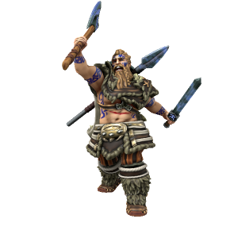

/ʊθgɑr/

Hero and namesake of the Uthgardt people, Uthgar was an immensely powerful warrior who helped bring an end to the megalithic age by slaughtering many of the megaliths still roaming the earth in his time. His daemon manifestation watches over the Uthgardt people, granting powers to those who gain his favour and imbuing relics from his mortal life with a fraction of his power.