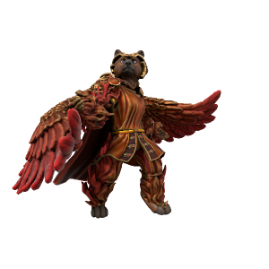

/hɛstɔrə/

_Seraph of Storgic Love_

Final of the three major love daemons, Hestora is manifest from loyal and dutiful love. The quiet love which sustains us day to day, the tender love of placing a blanket over a sleeping friend, of a parent holding their newborn babe and rocking them to sleep.