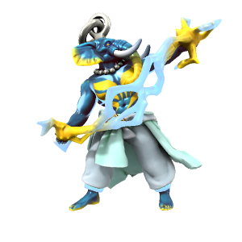

/skaɪfɑðə/

The Skyfather is the essence of the open sky - thunder, lightning, clouds and the air are all His domain. As one of the most powerful and important [fey](Fey.md), He features in most pantheons across Iuncterra, going by various names.

To the people of [Ordo'Atkan](../../Locations/Ordo'Atkan/Ordo'Atkan.md) and the pre-elven tribes of [Kashar](../../Locations/Kashar/Kashar.md), He is Tenger /tɛŋɡə/. To the people of [Drace](../../Locations/Drace/Drace.md), He is Oron /ɔrɒn/. To the dwarves of [Kaiper](../../Locations/Kaiper/Kaiper.md), he is Pater Oura /peɪtər oʊrə/. Prior to the establishment of the Uthgardt faith, he was known to the early [Humans](../../Species/Homonids/Humans.md) and [Iotun](../../Species/Homonids/Iotun.md) of the cold north as Tordensvadr /turdɛnzvɑdə/.

Skyfather takes form on the mortal plane as a [Loxodon](../../Species/Homonids/Loxodon.md), the species being created from [Orc](../../Species/Homonids/Orc.md) by His interference to exist in His image. Despite this, most Loxodon now follow the Kasharite faith, worshipping the Eternal Flame of the Kash dynasty.