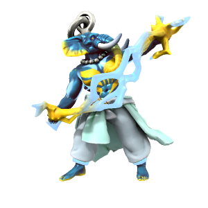

# Skyfather
/skaɪfɑðə/

The Skyfather is the essence of the open sky - thunder, lightning, clouds and the air are all His domain. As one of the most powerful and important [fey](/Species/Fey), He features in most pantheons across Iuncterra.

Skyfather takes form on the mortal plane as a [Loxodon](/Species/Godtouched/Loxodon.md), the species being created from [Orc](/Species/Homonid/Orc.md) by His interference to exist in His image. Despite this, most Loxodon now follow the Kasharite faith, worshipping the Eternal Flame of the Kash dynasty.

### Aliases
| Alias      | Pronunciation | Peoples |
| --- | --- | --- |
| Ouron Teng | /oʊrɒn tɛŋg/  | Pre-elven [Kashar](/Locations/Kashar), [Ordo'Atkan](/Locations/Ordo_Atkan) |
| Ötengr     | /øtɛŋgr/      | [Uthgardt](), Jotunnar  |
| Pater Oura | /peɪtər oʊrə/ | [Drace](/Locations/Drace) |
| Auro       | /aʊrø/        | [Kaiper](/Locations/Kaiper) |