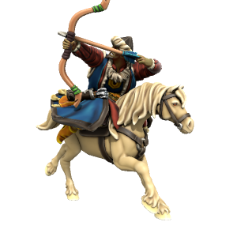

All Atkani are expected to be proficient in both horseriding and archery, a tradition called the "Way Of The Open Sky", meaning any given civillian can serve as a Keshik, a mounted horse archer warrior. When united, the Atkani Horde is near unstoppable, but the nomadic lifestyle of the Atkani people places a logistical restraint on sustained campaigns. The Horde prefer instead to hit hard and fast, decimating the enemy and exacting tribute before returning to their homelands.

### Keshik
Mounted archers, the key unit of the Ordo'Atkan horde. The shortbow sacrifices range for accuracy and speed, these units hit fast and hard, deadly at mid range.

