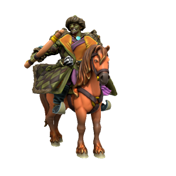

🗣[əʊlɒn sʊm]()

> **Pronouns** he/him
> **Species** [Orc](../../Species/Homonids/Orc.md)
> **[Age](../../Species/Ageing.md)** ...
> **Affiliations** [Ordo'Atkan](../../Locations/Ordo'Atkan/Ordo'Atkan.md)

#### Ideals
Olon Sum lives by the Way Of The Open Sky. He values strength and stoic honour, viewing settled metropolitanism as a degeneracy.

#### Bonds
Born a Kasharite slave, he killed his captors and escaped to find his people slaughtered and his homelands ravaged by the Khanate. He swears to one day destroy the Khanate and holds a particular hatred of the elves.

#### Flaws
He is stubborn, quick to anger, and quicker to resort to violence. He has won the love and respect of his people, but his hatred of cityfolk, particularly Kasharites, often clouds his judgement.

---
Great warlord in the lands of Ordo'Atkan, leader of the orc hordes. Through might and will he was able to unite the warring tribes into a single force, dominating any who did not swear fealty. The horde make frequent raids on Jami Satru, but the "City Of Enemies" has always withstood attack.