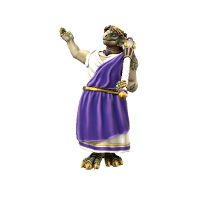

# Lucius Julianus Severus Regis
/lusiʌs ʤuəliɑnʌs sɛvərʌs riʤɪz/

> **Pronouns** He/Him
> **Species** [Dracean](../../Species/Homonid/Dracean.md)
> **[Age](../../Species/Ageing.md)** 123
> **Affiliations** [Drace](../../Locations/Drace/Drace.md)

#### Ideals
...

#### Bonds
...

#### Flaws
Pompous, incompetant and spoiled. Like so many of his forebearers, Lucius Julianus is essentially a useless stuffed toga.

---

Lucius Julianus Severus Regis, Impirator of the Dracean Empire, Governor of the Eternal City of Drace, Protector of the Realm and Rex Dignitas Suprema, is the ceremonial figurehead of the city of [Drace](../../Locations/Drace/Drace.md).