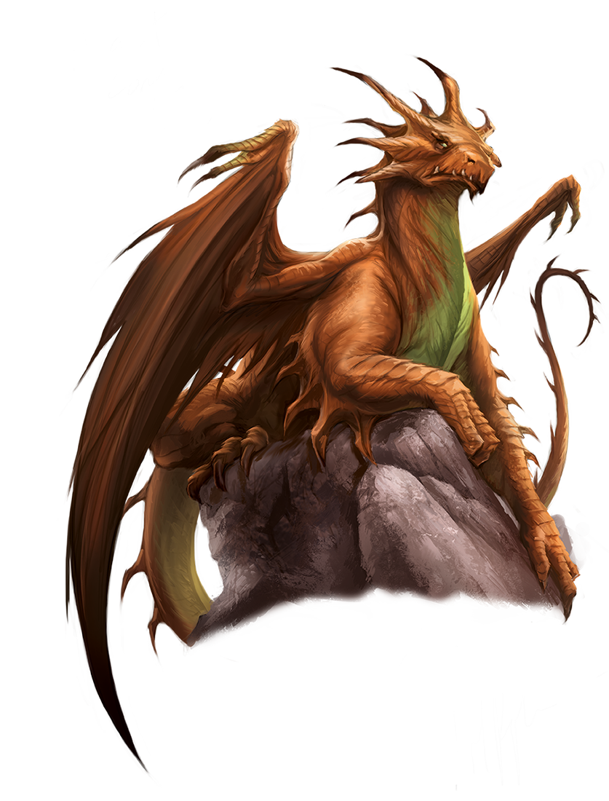

Protector of the island of [Kaiper](../../Locations/Kaiper/Kaiper.md), Kypra is unusually benevolent for a dragon. Most would render the land around their mountain home uninhabitable to any homonids unlucky enough to live there, so as to protect their hoards and ensure their long slumbers go undisturbed, but the [Dwarf](../../Species/Homonids/Dwarf.md) of Kaiper seem to thrive and, in fact, enjoy a considerable amount of favour from her. 