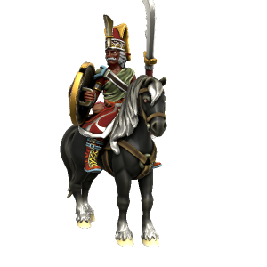

/jæpmæk/

> **Pronouns** he/him
> **Species** [Human](../../Species/Homonid/Human.md) / [Elf](../../Species/Homonid/Elf.md)
> **[Age](../../Species/Ageing.md)** ...
> **Affiliations** [Kashar](../../Locations/Kashar/Kashar.md)

#### Ideals
...

#### Bonds
...

#### Flaws
...

---