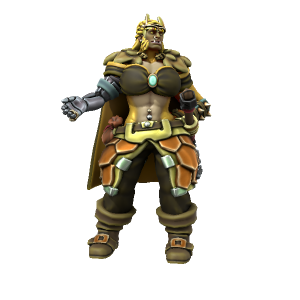

Bertha Bloodletter captains the privateer vessel [The Vengeance](../../Organisations/Bloodswords/Ships/The%20Vengeance.md), a powerful warship in the [Bloodswords](../../Organisations/Bloodswords/index.md)' fleet, with a fearsome reputation. Truly an imposing figure, her skill in battle is the stuff of legends. While her leadership style is undoubtedly harsh, The Vengeance is never short of eager recruits. Serving under Bertha is a dangerous venture, but one with a great deal of potential for profit. As hard as she is on her crew, she is never anything but generous in the distribution of plunder.

### History

Unlike most captains, Bertha didn’t work her way up to the rank - she took it by force. The Vengeance’s original owner was a powerful sorcerer, particularly adept at flame conjuration. He was a formidable fighter by all means, but he made the mistake of crossing Bertha. Though she lost an arm in the process, she walked away from their battle the victor, and took the now vacant position of captain for herself. In her early days as captain, she cowed the crew into submission - ruling through fear. But as time passed and the plunder began to roll in, the attitudes of the crew towards their new captain slowly shifted from fear to genuine respect. Or they died. Either way, she now commands sailors who are fiercely loyal to her.

### Relationships

At one time, Bertha was married to [Johnny Platinum](https://cobalt-sea.fandom.com/wiki/Johnny_Platinum "Johnny Platinum"). While she doesn’t necessarily understand his distaste for violence and ambition, and now finds him somewhat strange and confusing, she still holds him in very high regard, having loved him in his prime. Likewise, he holds a tremendous respect and admiration for her, the two remain close friends and correspond regularly.