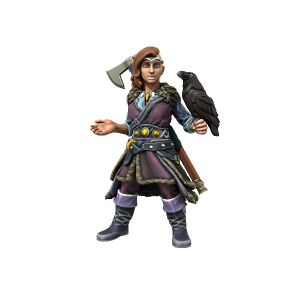

/flugmɪə hræfndo̞tɜ/

Flugmaer excells at two things: Flying and drinking. A tremendously skilled pilot, she rose to the role of Jarl at a young age after her Father, Jarl Hrafn, was shot down by Neverwinter forces during a raid on an outlying village. Flugmaer is a firm friend of Jarl [Viðar Norgandr](Viðar%20Norgandr.md) of the Grey Wolf tribe, both politically and personally. While the two have no plans at formalising their union through marriage, seeing such things as a Southern corruption of the Old Ways, their romantic (or, at least, sexual) relationship is no secret.