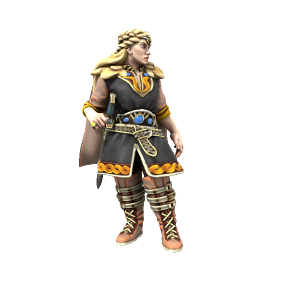

The Jarl of the Thunderbeast Tribe is a grim figure, rarely known to smile and certainly never to joke. Even as a child, she was strangely quiet and focussed, owing to much of the mythos surrounding her. While she is a capable warrior, her real strength lies in strategy: She always seems to be ten steps ahead of her enemy. Ruthlessly pragmatic and single minded in her devotion to her tribe, the Fylkir is a force to be reckoned with.