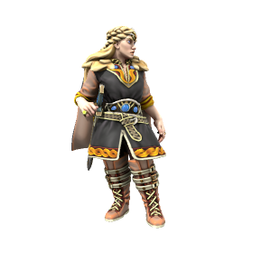

/hɛstæ θrʊmzdo̞tɜ/

> **Pronouns** she/her
> **Species** [Human](../../Species/Homonids/Humans.md) ([Uthgardt](index.md))
> **Age** 23
> **Affiliations** [Uthgar](../../Cosmology/Daemons/Apotheotes/Uthgar.md), Thunderbeast Tribe, Fylkiriate 

#### Ideals
Firmly believes in the concept of the Fylkiriate, believing that the [Uthgardt](index.md) faith needs reformation if it's to survive, particularly with the threat of [Wilhelm van Noord](../DIR%20Citizens/Wilhelm%20van%20Noord.md) and the DIR looming.

#### Bonds
Despite the political nature of their marriage, Haesta really does love her malewife [Slásverd af Fylkir](Slásverd%20af%20Fylkir.md). She also has good relationships with her allies in the Fylkiriate cause, apart from [Örmar Silfurorð](Örmar%20Silfurorð.md), who she tolerates but does not trust.

#### Flaws
Stubborn, overly ambitous and self important. Haesta doesn't just believe the Uthgardt need saving, she believes she has to be the one to save them. If she gave some ground to the rebels, she may be able to truly unify the people.

---

The Jarl of the Thunderbeast Tribe is a grim figure, rarely known to smile and certainly never to joke. Even as a child, she was strangely quiet and focussed, owing to much of the mythos surrounding her. While she is a capable warrior, her real strength lies in strategy: She always seems to be ten steps ahead of her enemy. Ruthlessly pragmatic and single minded in her devotion to her tribe, the Fylkir is a force to be reckoned with.