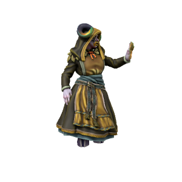

/nɜrn ælfɜzdo̞tɜ/

> **Pronouns** they/them
> **Species** [Gandrites](../../Species/Homonids/Gandrites.md)
> **Age** 124
> **Affiliations** [[Uthgar]], Great Tree Tribe, Uthgardt Rebellion

#### Ideals
Norn's visions mostly pertain to the destruction wrought when her people leave their home to conquer the world below. She will do anything to prevent this and believes the spiritual beliefs of the Uthgardt are key to stopping them.

#### Bonds
Deep connection to the Great Tree.

#### Flaws
She cares more about the life of the forest than the lives of homonids.

---

The Ghost Tree tribe are rarely seen, even by other Uthgardt tribes. These mysterious folk are intensely attuned to the natural world and, unlike most Uthgardt, are adept casters. Norn came to the tribe after fleeing her home and her people, finding refuge when the Great Tree spoke to her. Her connection to the Tree runs so deep that the tribe made her Jarl.