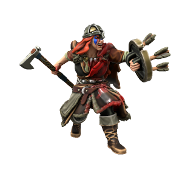

When tucking their children into beds at night, parents along the Sword Coast tell their children stories of the fearsom Viking queen. Her red hair like fire, the scar running down the length of her face, her utter ruthlessness and lack of a moral compass. In truth, Veida is a fairly personable and honourable sort, who sees raiding as a sacred tradition of her people. By birth, she was heir to the Great Worm tribe, but when she felt the call of the sea she left for the Red Tigers and quickly rose to become Jarl of this more worldly and meritocratic tribe. Now her sister, Ormunda, rules in her place. The two have an icy and hostile relationship, but family is family.