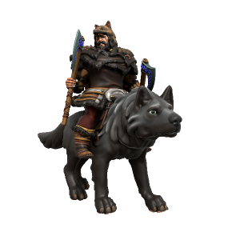

/vɪdɑ nɔgændə/

> **Pronouns** he/him
> **Species** [Human](../../Species/Homonids/Humans.md) ([Uthgardt](../../index.md), Lycanthrope)
> **Age** 34
> **Affiliations** [Uthgar](../../Cosmology/Daemons/Apotheotes/Uthgar.md), Uthgardt Rebellion, Grey Wolf Tribe

#### Ideals
Vidar is a devout follower of [Uthgar](../../Cosmology/Daemons/Apotheotes/Uthgar.md), a traditionalist who very much keeps to the old ways. He believes that Uthgar is best revered by tribes adhering to the dogma of their totems, and that a central authority of the Uthgardt faith would fundamentally undermine its culture.

#### Bonds
Vidar is fiercely loyal to his kinsmen in the Grey Wolf tribe. His sexual relationship with [Flugmær Hrafndottr](Flugmær%20Hrafndottr.md) is also one of the worst kept secrets in the North.

#### Flaws
He is stubborn, zealous and quick to anger. 

---

Of those who oppose Jarl [Hæsta Þrumsdottr](Hæsta%20Þrumsdottr.md)'s claim to the Fylkiriate, the most prominent is the Jarl of the Grey Wolf Tribe. Vidar is a vicious acolyte of the Old Ways and has more than earned his byname "Norgandr" (Beast Of The North). A physically intimidating figure, Vidar stands taller even than most Northlanders in his human form and larger than most horses in wolf form.