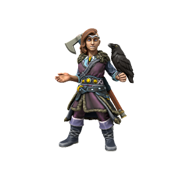

# Flugmær Hrafndottr
/flugmɪə hræfndo̞tɜ/

> **Pronouns** she/her
> **Species** [Human](../../Species/Homonid/Human.md) ([Uthgardt](../../index.md))
> **Age** 24
> **Affiliations** [Uthgar](../../Cosmology/Daemons/Apotheotes/Uthgar.md), Uthgardt Rebellion, Great Raven Tribe

#### Ideals
Devout follower of the old ways, particularly the spiritual and mystical aspects. After sneaking out of a Great Blot as a child, she saw the ravens of Uthgar carrying the sacrifices away, which profoundly affected her.

#### Bonds
Sexual relationship with [Viðar Norgandr](Viðar%20Norgandr.md) is one of the worst kept secret in the North.

#### Flaws
Drinks too much, often overly idealistic and fails to consider practical implications.

---

Flugmaer excells at two things: Flying and drinking. A tremendously skilled pilot, she rose to the role of Jarl at a young age after her Father, Jarl Hrafn, was shot down by Neverwinter forces during a raid on an outlying village. Flugmaer is a firm friend of Jarl [Viðar Norgandr](Viðar%20Norgandr.md) of the Grey Wolf tribe, both politically and personally. While the two have no plans at formalising their union through marriage, seeing such things as a Southern corruption of the Old Ways, their romantic (or, at least, sexual) relationship is no secret.