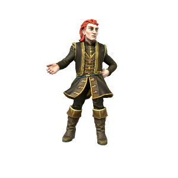

/ɔmɑ sɪlfɔrɔð/

> **Pronouns** he/him / they/them
> **Species** [Human](../../Species/Homonids/Humans.md) ([Uthgardt](../../index.md))
> **Age** 29
> **Affiliations** Black Tiger Tribe, Uthgardt Fylkiriate

#### Ideals
Ormar is a moderniser, he's somewhat disdainful of his native Uthgardt culture and so is keen to adopt more "civilised" southern culture. He's also a gifted and ambitious politician.

#### Bonds
Perhaps the only Uthgardt to have a good relationship with the [DIR](../../Locations/Dracean%20Intercoastal%20Republic/Dracean%20Intercoastal%20Republic.md), Ormar enjoys a cozy relationship with the southern states.

#### Flaws
Sneaky, deceitful and duplicitous. Boundless ambition with very little loyalty.

---

One of the lesser known Uthgardt traditions is the sport of "flyting", in which participants take turns exchnging insults and personal jabs until one person surrenders. While there are certainly Uthgardt who surpass Jarl Örmar in physical strength, they are absolutely unrivalled at flyting. Their keen gaze and cutting wit can reduce even the burliest of bruisers to tears in a matter of minutes. While they acknowledge and offer some support for Jarl Haesta's claim to the Fylkiriate, they have thus far held themselves back from any major military maneuvers, exercising their influence slowly and strategically.