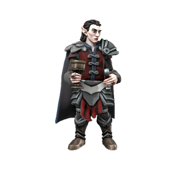

/stræd/

### The First Vampire
Strahd promised his allegience to [Erodite](../../Cosmology/Daemons/Erodite.md) in exchange for powers of seduction, to [Avikath](../../Cosmology/Daemons/Malefices/Avikath.md) in exchange for power, and to [Loga](../../Cosmology/Daemons/Malefices/Loga.md) in exchange for the power to bend others to his will. All believed they were his sole master, but all were deceived. With none wanting to claim him for fear of conflict with one another, Strahd walked away with powers beyond any mortal before, having given nothing.