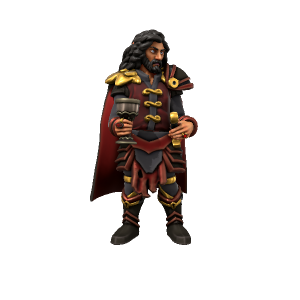

/stræd/

> **Pronouns** he/him
> **Species** [Vampire](index.md)
> **Age** Unknown
> **Affiliations** None

#### Ideals
Above all else, Strahd lusts for power. Despite his utter dominion over all he surveys, he always wants more. His ultimate goal is to gain such notoriety on earth that he manifests as an [Apotheote](../../Cosmology/Daemons/Apotheotes/index.md), at which point he can usurp [Loga](../../Cosmology/Daemons/Malefices/Loga.md) as the malefice of deception and gain his rightful place in the pantheon of gods.

#### Bonds
Strahd has powerful enemies. Having tricked the daemons [Erodite](../../Cosmology/Daemons/Erodite.md), [Avikath](../../Cosmology/Daemons/Malefices/Avikath.md) and [Loga](../../Cosmology/Daemons/Malefices/Loga.md) by playing them against one another, these three each hold a deep resentment towards him. All vampires, however, are loyal to him, being their creator and master.

#### Flaws
Strahd has no regard for others, he cares for no one but himself. He's fallen in love, many times, but his love is always fleeting and self serving. The one thing he truly loves is power.

---

### The First Vampire
Strahd promised his allegience to [Erodite](../../Cosmology/Daemons/Erodite.md) in exchange for powers of seduction, to [Avikath](../../Cosmology/Daemons/Malefices/Avikath.md) in exchange for power, and to [Loga](../../Cosmology/Daemons/Malefices/Loga.md) in exchange for the ability to bend others to his will. All believed they were his sole master, but all were deceived. With none wanting to claim him for fear of conflict with one another, Strahd walked away with powers beyond any mortal before, having given nothing.