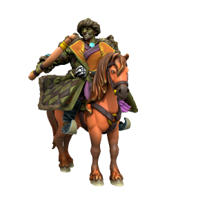

*He/Him, Orc, Lawful Neutral*

Great warlord in the lands of Ordo'Atkan, leader of the orc hordes. Born a Kasharite slave, Olon Sum killed his captors and escaped to find his people slaughtered and his homelands ravaged by the Khanate. Through might and will he was able to unite the warring tribes into a single force, dominating any who did not swear fealty. He swears to one day destroy the Khanate and holds a particular hatred of the elves. The horde make frequent raids on Jami Satru, but the "City Of Enemies" has always withstood attack.
