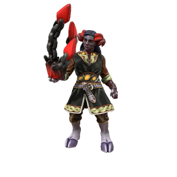

/gændraɪt/

Far in the northern reaches of Iunterra, past the forgotten hills to the frozen north where only a handful of particularly hardy jotun dare to dwell, lies a portal to the daemon realm. Through circumstances lost to history, a child was born of a jotun and a daemon; the first gandrite. Gandrites posess only a small fraction of the power of their daemonic ancestors, but being able to multiply makes them formiddable. As the world slumbers, their numbers grow.