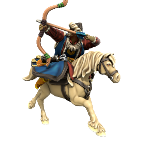

### Orc 
/ɔk/

Outside of the Eternal City of Drace, descendents of Draconus met and freely fell in love with iotun. Over time, the differences between these two species' became less distinct, until the majority of the population outside of Drace and the iotun homelands in the North became altogether different from either ancestor species. Thus, orc came into being.