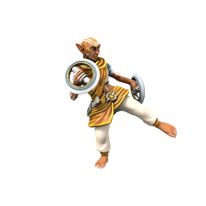

# Herbad
Qualified keeper of the sacred flame. Master of martial arts and dedicated religious zealot.

> **Armour Class** 16
> **Hit Points** 38 (6d8 + 11)
> **Speed** 45ft.
> **Ki** 5, save 13
> **Proficiency Bonus** +3
>
> ---
>
> | STR  | CON  | DEX  | INT  | WIS  | CHR  |
> | ---- | ---- | ---- | ---- | ---- | ---- |
> | +0   | +1   | +3   | +0   | +3   | +0   |
> | 11   | 13   | 16   | 11   | 16   | 11   |
>
> ---
>
> **Martial Arts** After an attack using no weapon or a monk weapon, the Herbad can perform an unarmed attack as a bonus action.
>
> - [ ] **Wholeness of Body** As an action, restore 15hp.
>
> ---
>
> **Unarmed Strike** *Melee Attack* +6 to hit, 1d4 bludgeoning.
>
> **Chakram Hoop** *Melee (Monk) Weapon Attack* +6 to hit, 1d6 bludgeoning + 1d4 slashing.
>
> ---
>
> ***χ Flurry of Blows*** Immediately after an action, make two unarmed strikes as a bonus action. On hit, either:
>
> - Target must succeed on a Dexterity saving throw or be knocked prone.
> - Target must make a Strength saving throw or be pushed up to 15 feet away.
> - Target can't take reactions until the end of  the Herbad's next turn.
>
> **χ Patient Defense **Take the [Dodge](https://www.dndbeyond.com/sources/basic-rules/combat#Dodge) action as a bonus action on your turn.
>
> **χ Step of the Wind** Take the [Disengage](https://www.dndbeyond.com/sources/basic-rules/combat#Disengage) or [Dash](https://www.dndbeyond.com/sources/basic-rules/combat#Dash) action as a bonus action on your turn, and your jump distance is doubled for the turn.
>
> #### Spellcasting
>
> **Spellslots** None
> **Spell Save DC** 13
>
> 0. [Sacred Flame](https://www.dndbeyond.com/spells/sacred-flame)

---