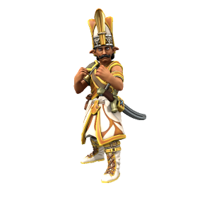

# Janissary
Elite infantry unit, the jewel of the Kashar army.

> **Armor Class** 10
> **Hit Points** 32 (5d8 + 10)
> **Speed** 30 ft.
>**Proficiency Bonus** +3
> 
>---
> 
>| STR  | CON  | DEX  | INT  | WIS  | CHR  |
> | ---- | ---- | ---- | ---- | ---- | ---- |
>| +2   | +1   | +0   | +0   | +0   | +0   |
> | 14   | 13   | 11   | 10   | 11   | 10   |
>
> ---
>
> **Pack Tactics.** The janissary has advantage on attack rolls against a creature if at least one of its allies is within 5 feet of the creature and the ally isn't incapacitated.
>
> ---
>
> **Multiattack.** The janissary makes two Sword attacks or one sword attack and one unarmed.
>
> **Unarmed Strike** *Melee Attack*: +5 to hit, for 1d6 bludgeoning damage. On critical success, knocks target [prone](https://www.dndbeyond.com/compendium/rules/basic-rules/appendix-a-conditions#Prone).
>
> **Scimitar Sword.** *Melee Weapon Attack*: +5 to hit for 1d6 + 4 slashing damage.

---