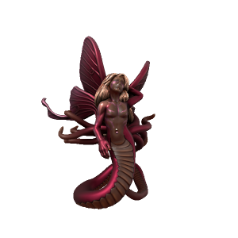

# Erodite

### Daemon of Erotic Love

First of the three major love daemons, Erodite is manifest from raw sexual lust. Not greed, as with Avikath, just pure and simple animalistic lust. They are simply an urge.

| Language | Name | Pronunciation |
| ---      | ---  | ---           |
| [Common](/languages/common) | Erodite | /ərɒdɪteɪ/ | 
| [Dracean](/languages/dracean) |  | // | 
| [Uttic](/languages/uttic) | Frödi | /fröʊdi/ | 
| [Noordic](/languages/noordic) |  | // | 
| [Jotic](/languages/jotic) |  | // |
| [Atkani](/languages/atkani) | ' | /'/ | 
| [Savonic](/languages/savonic) | ' | /'/ | 
| [Kushite](/languages/kushite) | ' | /'/ | 
| [Loxan](/languages/loxan) |  | // | 
| [Parbati](/languages/parbati) |  | // | 
| [Scutian](/languages/scutian) |  | // | 
| [Servian](/languages/servian) |  | // | 
| [Kypritic](/languages/kypritic) |  | // | 
| [Ataithan](/languages/ataithan) |  | // |