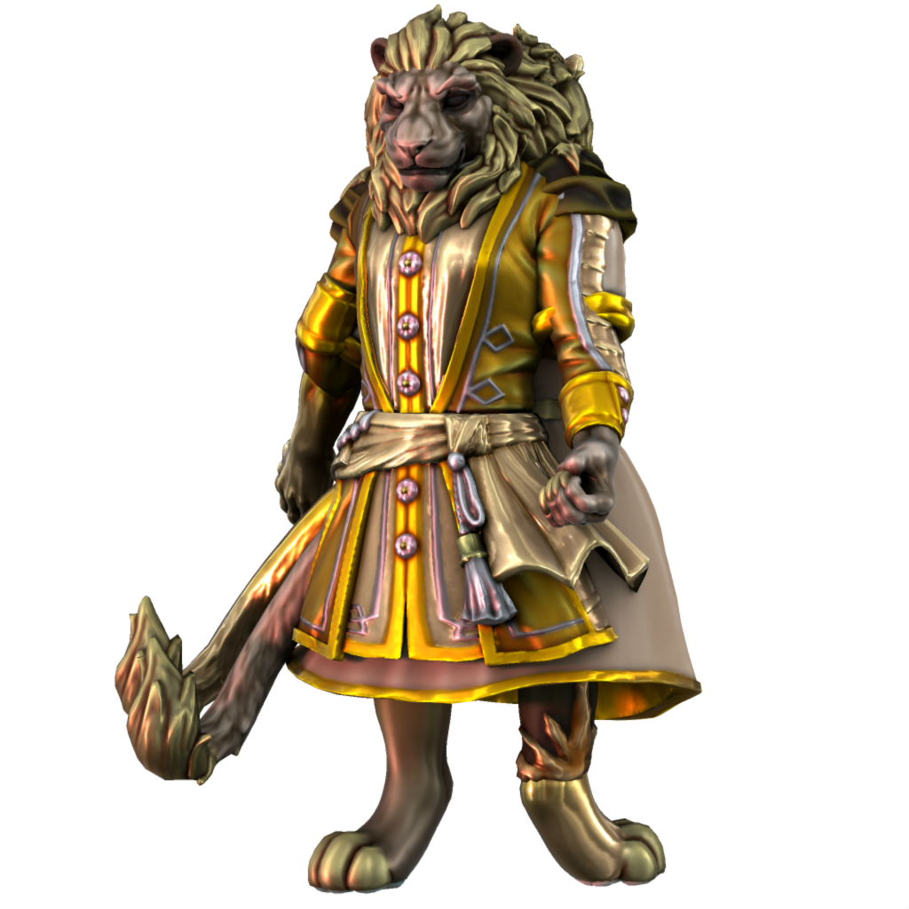

# Ianoa

### Malefix of pride

Ianoa embodies the bad aspects of pride; boastfulness, derision, arrogance.

#### The Two Faced God

Ianoa is irrevocably joined to his inverse, [Aonai](/cosmology/daemons/seraphim/aonai), who embodies the positive aspects of pride. When in the material realm, the two appear as conjoined, each controlling one arm, one leg, and one tail.