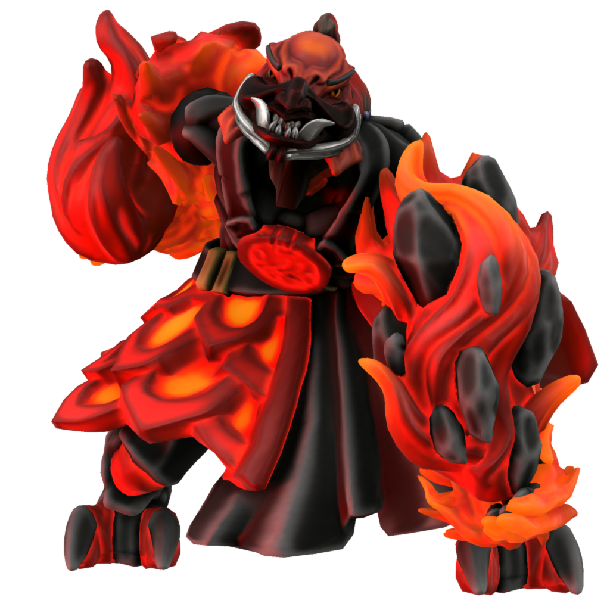

# Surt

### Malefix of destruction

Surt is, plain and simple, the will to destroy. Motives are irrelevant, whether the destruction comes from righteous anger, from vengeance, from greed... So long as there is a mortal who wishes to see some one or some thing in ruins, Surt will retain his power.

Surt has fought under many daemon generals, but he owes allegience to none. He is happy to march to the banner of whomever looks set to strew the greatest destruction.

Once, when dragons ruled the skies and the mortal creatures of Iuncterra were vast wild beasts, Surt was fully unchained. However, destruction does not always serve the interests of his fellow daemons... Making a deal with fey of the fertile lands where mortals would later cultivate the soil and thrive, [Avikath](avikath) crafted a muzzle for Surt's snout which holds him back from unleashing utter anihilation upon the world.

#### Names

| Language | Alias | Pronunciation |
| ---      | ---   | ---           |
| [Common](/languages/common) | Surt | /sɜt/ | 
| [Dracean](/languages/dracean) | Sutum | /sʊtʊm/ | 
| [Uttic](/languages/uttic) | Surtr | /sɜtɜ/ | 
| [Noordic](/languages/noordic) | Surtr | /sɜtɜ/ | 
| [Jotic](/languages/jotic) | Surtr | /sɜtr/ |
| [Atkani](/languages/atkani) | Sur'ib | /soʊr'ib/ | 
| [Savonic](/languages/savonic) | Ib'zur | /ib'zɜ/ | 
| [Kushite](/languages/kushite) | Ibl'zura | /ɪbl'zɜra/ | 
| [Loxan](/languages/loxan) | Xera | /zɜra/ | 
| [Parbati](/languages/parbati) | Djet | /ʤʃɛt/ | 
| [Scutian](/languages/scutian) | Jet | /ʤɛt/ | 
| [Servian](/languages/servian) | Zuto | /zʊto/ | 
| [Kypritic](/languages/kypritic) | Suttio | /suteo/ | 
| [Ataithan](/languages/ataithan) | Siarta | /ʃɑrtæ/ |