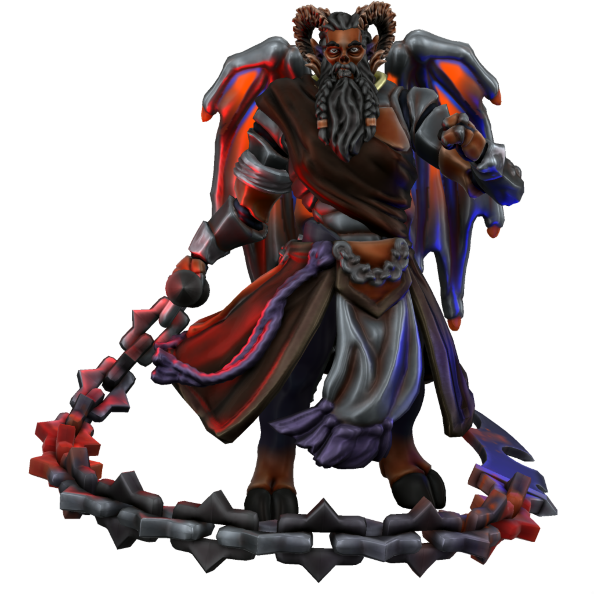

# Zukothoth

### Malefix of masochism

Zukothoth is the desire we all keep buried to do dreadful and grevious harm to ourselves. The feeling that we deserve punishment, not for any particular wrong doing but simply by virtue of our being. That whatever dreadful fate we are doomed to endure is entirely just and, in fact, what's best for us.

Since the Uthgardt age, Zukothoth has been trapped in the material plane, at the base of Beorunna's Well. There at the cold edge of the world he whispers in the ears of any foolish enough to enter the haunted ruins, begging them to help him, to release him, to help him bring the end that all mortals secretly crave.

#### Names

| Language | Name | Pronunciation |
| ---      | ---  | ---           |
| [Common](/languages/common) | Zukothoth | /zukəʊtɒθ/ | 
| [Dracean](/languages/dracean) | Zuktotum | /zʊktəʊtʊm/ | 
| [Uttic](/languages/uttic) | Thotur | /θotur/ | 
| [Noordic](/languages/noordic) | Thotr | /θotɜ/ | 
| [Jotic](/languages/jotic) | Toth | /toθ/ |
| [Atkani](/languages/atkani) | Zukt'ib | /zukt'ib/ | 
| [Savonic](/languages/savonic) | Ib'zukta | /ib'zuktə/ | 
| [Kushite](/languages/kushite) | Ibl'zuktra | /ɪbl'zuktra/ | 
| [Loxan](/languages/loxan) | Zuktra | /zuktra/ | 
| [Parbati](/languages/parbati) | Shuktot | /ʃʊktɒt/ | 
| [Scutian](/languages/scutian) | Jukti | /ʤukti/ | 
| [Servian](/languages/servian) | Shukit | /ʃʊkit/ | 
| [Kypritic](/languages/kypritic) | Juktos | /ʤuktos/ | 
| [Ataithan](/languages/ataithan) | Siokthat | /ʃəʊktaθ/ |
