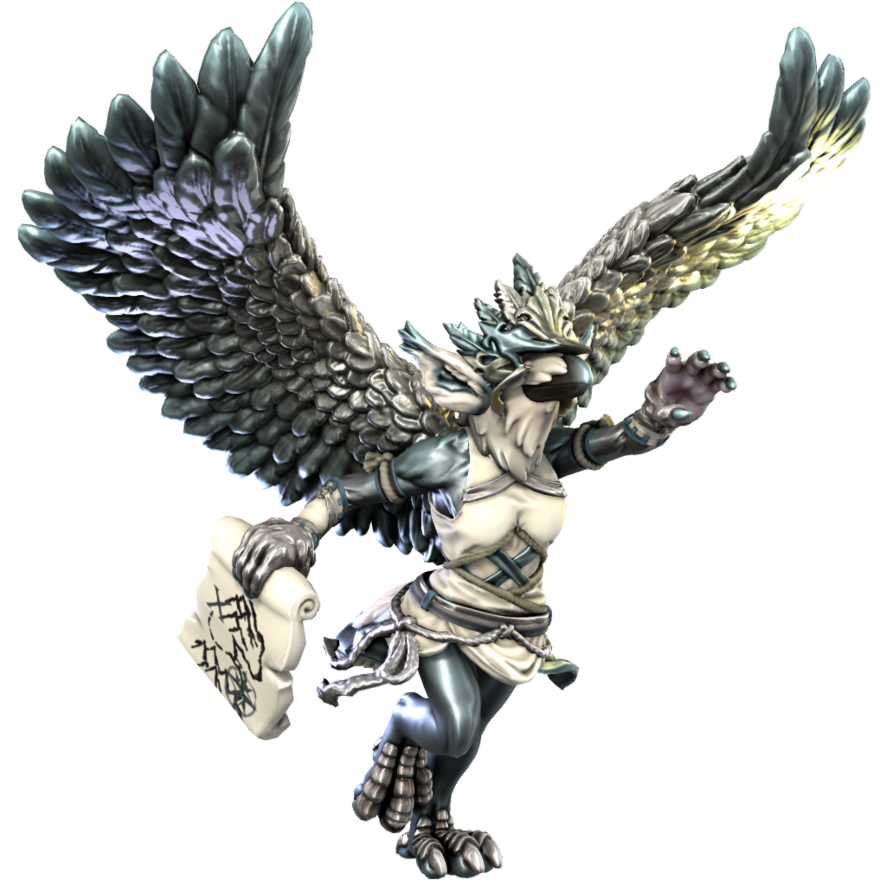

# Hermet

### Daemon of exploration

Hermet embodies the sapient urge for exploration, to see new places and unshroud the edges of the map. They take the form of a bird and appears often to travellers, guiding them to new discoveries.

| Language | Name | Pronunciation |
| ---      | ---  | ---           |
| [Common](/languages/common) | Hermet | /hɜmɛt/ | 
| [Dracean](/languages/dracean) | Kuros | /kʊrɔs/ | 
| [Uttic](/languages/uttic) | Hjorm | /hjɜum/ | 
| [Noordic](/languages/noordic) | Krússe | /kruʃ/ | 
| [Jotic](/languages/jotic) | Hjom | /hjɔm/ |
| [Atkani](/languages/atkani) | Khiru'ma | /kɪru'ma/ | 
| [Savonic](/languages/savonic) | Ma'khi | /ma'ki/ | 
| [Kushite](/languages/kushite) | Mir'kir | /mir'kɪə/ | 
| [Loxan](/languages/loxan) | Irumet | /ɪrumɛt/ | 
| [Parbati](/languages/parbati) | Qirim't | /khɪrɪm't/ | 
| [Scutian](/languages/scutian) | Hjimit | /hjɪmɪt/ | 
| [Servian](/languages/servian) | Kirimet | /kɪrɪmɛt/ | 
| [Kypritic](/languages/kypritic) | Herme | /ɜrmi/ | 
| [Ataithan](/languages/ataithan) | Ormte | /ɜrmeɪt/ |