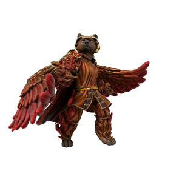

# Hestora

### Seraph of Storgic Love

Final of the three major love daemons, Hestora is manifest from loyal and dutiful love. The quiet love which sustains us day to day, the tender love of placing a blanket over a sleeping friend, of a parent holding their newborn babe and rocking them to sleep.

| Language | Name | Pronunciation |
| ---      | ---  | ---           |
| [Common](/languages/common) | Hestora | /hɛstɔrə/ | 
| [Dracean](/languages/dracean) | Hestor | /hɛstə/ | 
| [Uttic](/languages/uttic) | Frega | /frɛga/ | 
| [Noordic](/languages/noordic) | Friga | /friga/ | 
| [Jotic](/languages/jotic) | Freg | /frɪg/ |
| [Atkani](/languages/atkani) | Tur'a'ma | /tur'ə'ma/ | 
| [Savonic](/languages/savonic) | Ma'hest | /ma'həst/ | 
| [Kushite](/languages/kushite) | Mir'estra | /mir'ɛstrah/ | 
| [Loxan](/languages/loxan) | Heshra | /hɛʃrah/ | 
| [Parbati](/languages/parbati) | Hessit | /hɛsit/ | 
| [Scutian](/languages/scutian) | Hest | /hɛst/ | 
| [Servian](/languages/servian) | Gista | /ʔɪstə/ | 
| [Kypritic](/languages/kypritic) | Hira | /hɪərə/ | 
| [Ataithan](/languages/ataithan) | Hiorse | /hɛɪʃ/ |