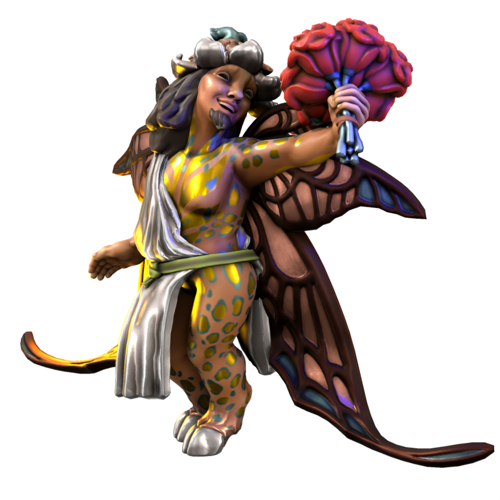

# Ludon
/ludɒn/

_Seraph of Ludic Love_

Second of the three major love daemons, Ludon is manifest from playful love. Love for life, adventure, parties and the pleasures of good company.

| Alias | Pronunciation | Peoples |
| --- | --- | --- |
| Ludonysos | /ludɒnɪsɒs/  | [Kypritic](/languages/kypritic) |
| Baluð     | /baluð/      |  [Uttic](/languages/uttic) |