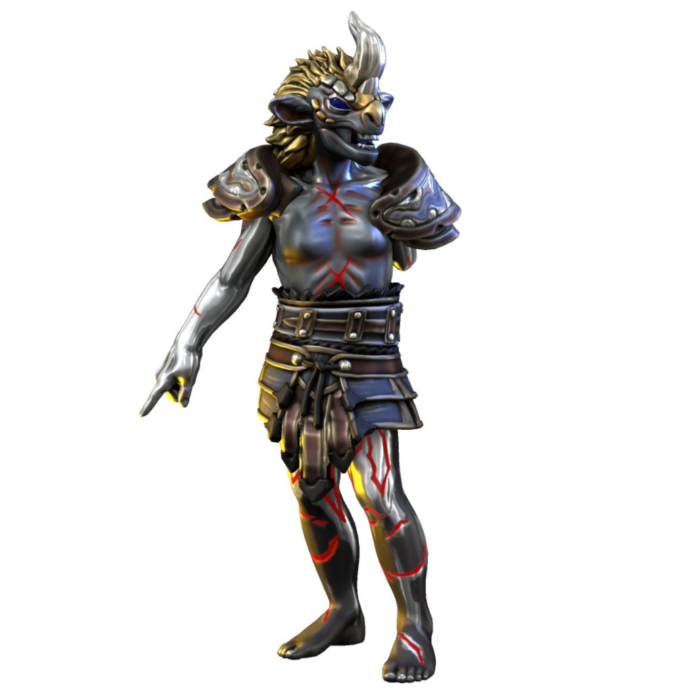

# Vilae

### Seraph of determination

Despite his grim demeanor and frightening appearance, Vilae is counted among the good-aligned seraphim. He embodies sheer force of will, which is generally a positive facet of the sapient psyche.

His thick hide is covered with long-healed scars and he is missing an arm. As the physical form of a daemon manifests according to their psychic domain, these are more symbolic than actual injuries he has sustained.

#### Names

| Language | Name | Pronunciation |
| ---      | ---  | ---           |
| [Common](/languages/common) | Vilae | /vɪleɪ/ | 
| [Dracean](/languages/dracean) | Vilae | /vɪleɪ/ | 
| [Uttic](/languages/uttic) | Vili | /vɪli/ | 
| [Noordic](/languages/noordic) | Vilem | /wɪlem/ | 
| [Jotic](/languages/jotic) | Vilm | /wilm/ |
| [Atkani](/languages/atkani) | Vilu'ma | /vilu'ma/ | 
| [Savonic](/languages/savonic) | Ma'vi'lu | /ma'vɪ'lu/ | 
| [Kushite](/languages/kushite) | Mir'iru | /mir'iru/ | 
| [Loxan](/languages/loxan) | Moi | /mɔɪ/ | 
| [Parbati](/languages/parbati) | Mo'iru | mo'əru/ | 
| [Scutian](/languages/scutian) | Illu | /ilu/ | 
| [Servian](/languages/servian) | Miru | /mɪəru/ | 
| [Kypritic](/languages/kypritic) | Moiu | /mɔɪu/ | 
| [Ataithan](/languages/ataithan) | Miodhu | /maɪðə/ |