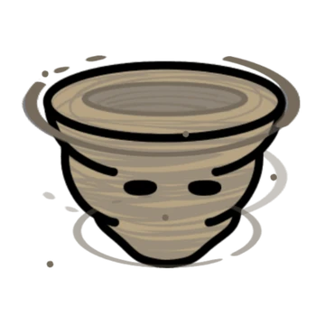

# Dervish



Dervish are the fey of small swirling gusts of wind. They are playful in nature, sometimes mischievous, but are generally not powerful enough to do any serious harm. 


```statblock:5e
### Dervish
[Fey rhea](/cosmology/fey/fey_rhea#bonding)

#### Idle effect
If known, increases the distance targets are pushed by the cantrip [Gust](https://www.dndbeyond.com/spells/2383-gust) by 5ft. If not known, grants the cantrip.

#### Activation effect
Cast [Warding Wind](https://www.dndbeyond.com/spells/2407-warding-wind) for free, but its duration is reduced to 1d4 turns (2d12 seconds outside of battle).

#### Summoning effect
Cast [Gust of Wind](https://www.dndbeyond.com/spells/2619137-gust-of-wind) for free, but rather than a 60ft line pushing in one direction, the gust is a 30ft radius centered on you which pushes either clockwise or counter clockwise. This direction can be flipped as a bonus action in later turns.

Summoning with more dervishes increases the distance pushed by 5ft. per dervish and the radius by 10ft. per dervish.
```