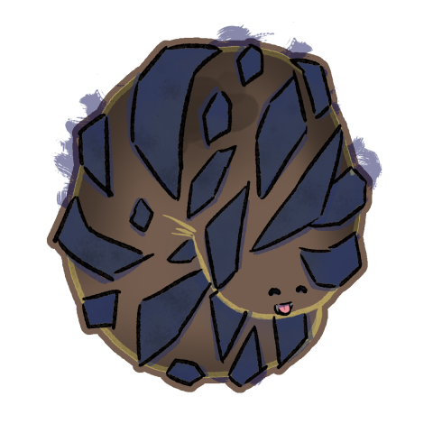
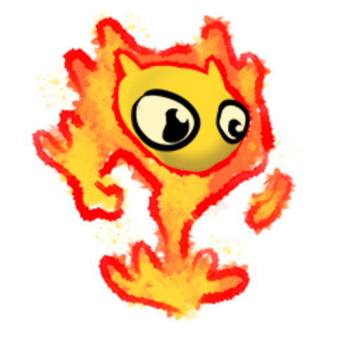

# Ifrit




Ifrit are fey who manifest as highly combustable materials (like the proto-thermite used in most forges), whose nature is fundamentally changed when these materials burn. As such they are seen as forge spirits, but are far older than the practice of metallurgy.

```statblock:5e
### Ifrit
[Fey rhea](/cosmology/fey/fey_rhea#bonding)

#### Idle effect
If known, increases the size of the bonfire created by the cantrip [Gust](https://www.dndbeyond.com/spells/2383-gust) by 5ft³. If not known, grants the cantrip.

#### Activation effect
Cast [Searing Smite](https://www.dndbeyond.com/spells/2619009-searing-smite) for free, then make an attack.

#### Summoning effect
Cast [Heat Metal](https://www.dndbeyond.com/spells/2619145-heat-metal) for free. 

Summoning with more ifrit upcasts the spells (+1 ifrit = +1 spell slot level).
```