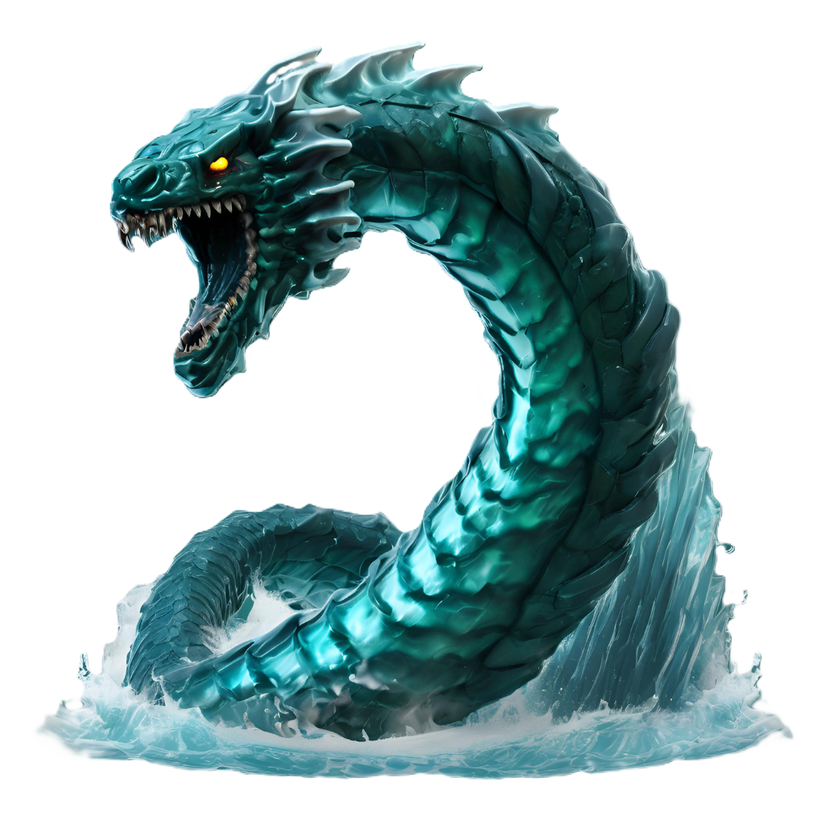

# Jor

Fey of the North Sea, a great serpent whose roiling body curled in upon itself manifested as the ever crashing waves of the frozen coast. He is forever moving, searching for an exit from his own endless body, in which he is inexorably tangled.

| Language | Name | Pronunciation |
| ---      | ---  | ---           |
| [Common](/languages/common) | Jor | /jɔ/ | 
| [Dracean](/languages/dracean) |  | // | 
| [Uttic](/languages/uttic) | Njörr | /ŋjöʊr/ | 
| [Noordic](/languages/noordic) |  | // | 
| [Jotic](/languages/jotic) |  | // |
| [Atkani](/languages/atkani) | ' | /'/ | 
| [Savonic](/languages/savonic) | ' | /'/ | 
| [Kushite](/languages/kushite) | ' | /'/ | 
| [Loxan](/languages/loxan) |  | // | 
| [Parbati](/languages/parbati) |  | // | 
| [Scutian](/languages/scutian) |  | // | 
| [Servian](/languages/servian) |  | // | 
| [Kypritic](/languages/kypritic) |  | // | 
| [Ataithan](/languages/ataithan) |  | // |