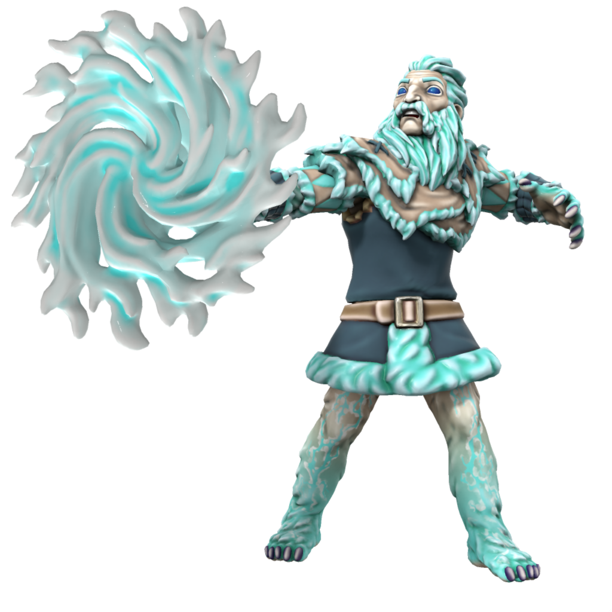

# Veldor

### Fey of the Veldspine mountains

Fey of the cold north lands, leader of the Veldspine mountain fey.

| Language | Name | Pronunciation |
| ---      | ---  | ---           |
| [Common](/languages/common) | Veldor | /vɛldɔ/ | 
| [Dracean](/languages/dracean) |  | // | 
| [Uttic](/languages/uttic) | Veldr | /vɛldr/ | 
| [Noordic](/languages/noordic) |  | // | 
| [Jotic](/languages/jotic) |  | // |
| [Atkani](/languages/atkani) | ' | /'/ | 
| [Savonic](/languages/savonic) | ' | /'/ | 
| [Kushite](/languages/kushite) | ' | /'/ | 
| [Loxan](/languages/loxan) |  | // | 
| [Parbati](/languages/parbati) |  | // | 
| [Scutian](/languages/scutian) |  | // | 
| [Servian](/languages/servian) |  | // | 
| [Kypritic](/languages/kypritic) |  | // | 
| [Ataithan](/languages/ataithan) |  | // |