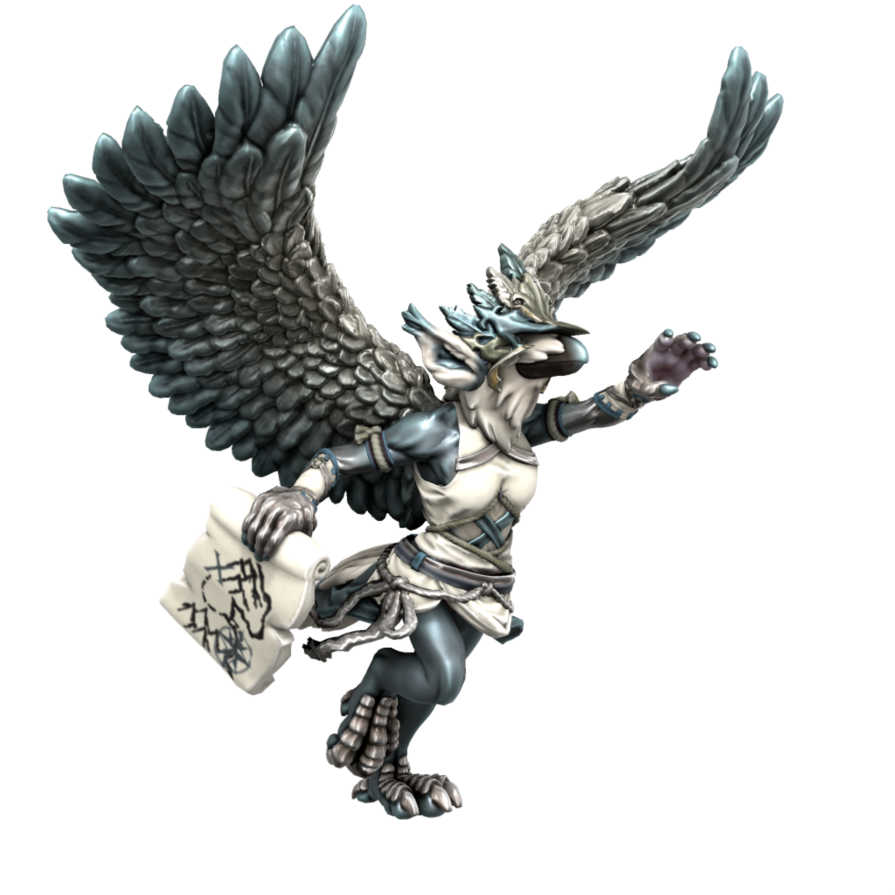

# Hermet
*Daemon of exploration*

Hermet embodies the sapient urge for exploration, to see new places and unshroud the edges of the map. They take the form of a bird and appears often to travellers, guiding them to new discoveries.

