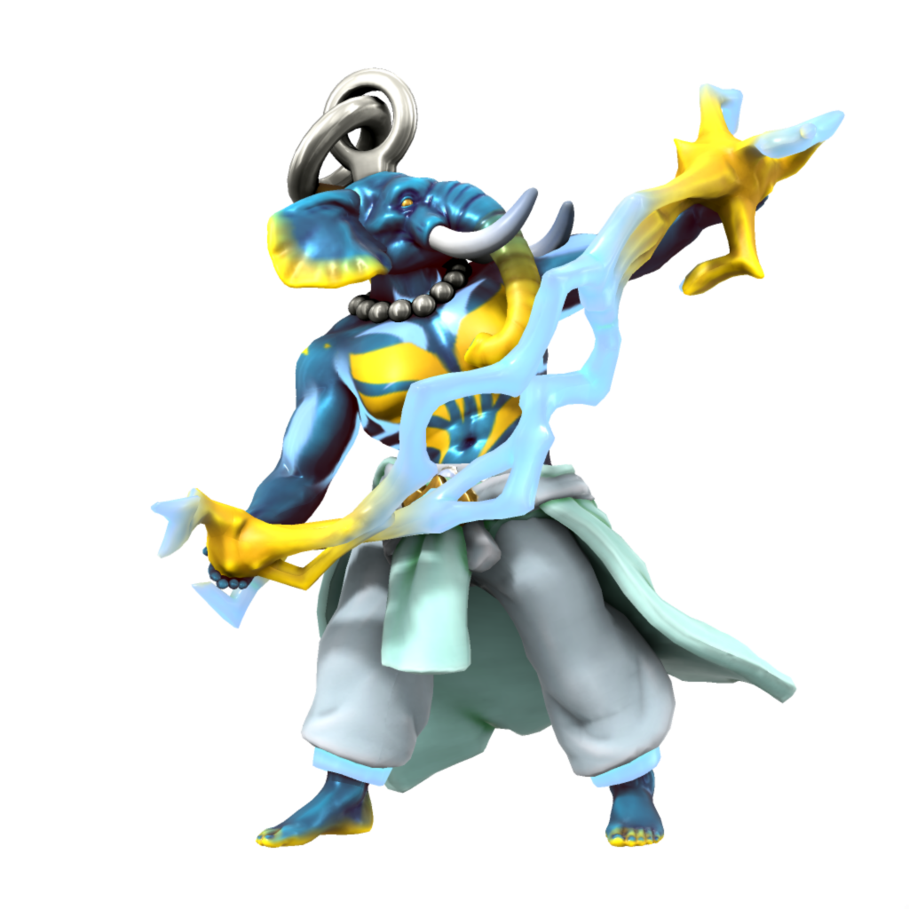

# Ouron
/urɒn/

Ouron is the essence of the open sky - thunder, lightning, clouds and the air are all His domain. As one of the most powerful and important [fey](/species/fey), He features in most pantheons across Iuncterra.

Ouron takes form on the mortal plane as a [Loxodon](/species/godtouched/loxodon), the species being created from [Orc](/species/homonid/orc) by His interference to exist in His image. Despite this, most Loxodon now follow the Kasharite faith, worshipping the Eternal Flame of the Kash dynasty.

### Aliases
| Alias      | Pronunciation | Language(s) |
| --- | --- | --- |
| Ouron Teng | /oʊrɒn tɛŋg/  | [Atkani](/lore/languages/atkani) |
| Ötengr     | /ltɛŋgr/      | [Uttic](/lore/languages/uttic)  |
| Pater Oura | /peɪtər oʊrə/ | [Dracean](/lore/languages/dracean) |
| Auro       | /aʊrø/        | [Kypritic](/lore/languages/kypritic) |