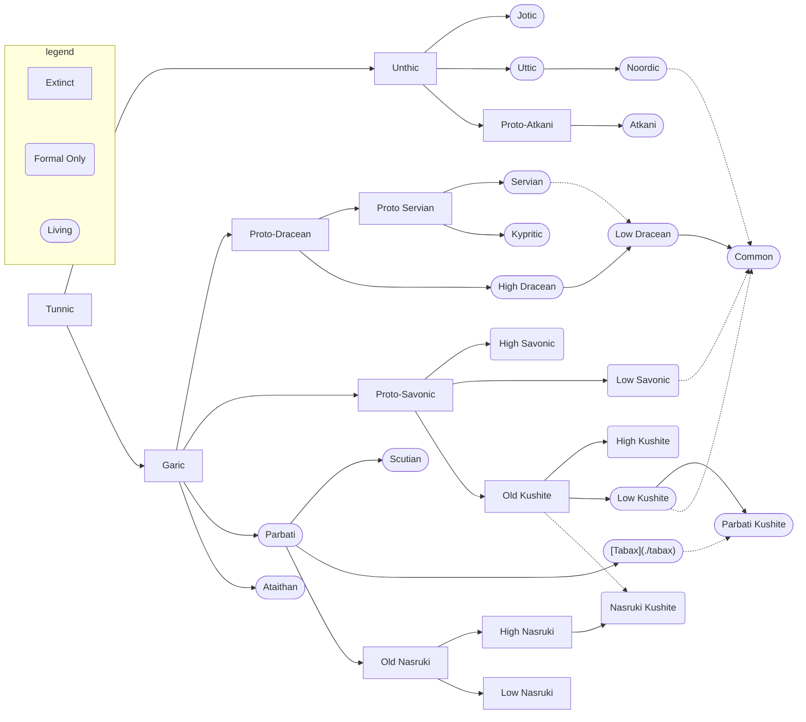

# Languages

The graph below shows how the various languages of Iuncterra inherit from one another, all stemming from a single common language spoken by the first iotun.

```mermaid
graph LR

%% define nodes
tunnic[Tunnic]
unthic[Unthic]
garic[Garic]
proto-dracean[Proto-Dracean]
proto-savonic[Proto-Savonic]
proto-atkani[Proto-Atkani]
parbati([Parbati])
old-nasruki[Old Nasruki]
high-nasruki[High Nasruki]
low-nasruki[Low Nasruki]
uttic([Uttic])
jotic([Jotic])
atkani([Atkani])
noordic([Noordic])
proto-servian[Proto Servian]
servian([Servian])
kypritic([Kypritic])
high-dracean([High Dracean])
low-dracean([Low Dracean])
tabax(["`[Tabax](./tabax)`"])
scutian([Scutian])
high-savonic(High Savonic)
low-savonic(Low Savonic)
old-kushite[Old Kushite]
high-kushite(High Kushite)
low-kushite([Low Kushite])
parbati-kushite([Parbati Kushite])
nasruki-kushite(Nasruki Kushite)
common([Common])
ataithan([Ataithan])

%% define relations
tunnic --> unthic

unthic --> jotic
unthic --> uttic
unthic --> proto-atkani
uttic --> noordic
proto-atkani --> atkani

tunnic --> garic

garic --> proto-dracean
proto-dracean --> proto-servian
proto-servian --> servian
proto-servian --> kypritic
proto-dracean --> high-dracean
high-dracean --> low-dracean
servian -.-> low-dracean

garic --> proto-savonic
proto-savonic --> high-savonic
proto-savonic --> low-savonic

proto-savonic --> old-kushite
old-kushite --> high-kushite
old-kushite --> low-kushite
low-kushite --> parbati-kushite
old-kushite -.-> nasruki-kushite

garic --> parbati
parbati --> scutian
parbati --> tabax
tabax -.-> parbati-kushite
parbati --> old-nasruki
old-nasruki --> high-nasruki
old-nasruki --> low-nasruki
high-nasruki --> nasruki-kushite

garic --> ataithan

low-dracean --> common
low-savonic -.-> common
noordic -.-> common
low-kushite -.-> common

%% legend
subgraph legend
  extinct[Extinct]
  court(Formal Only)
  living([Living])

  extinct ~~~ court ~~~ living
end

```

