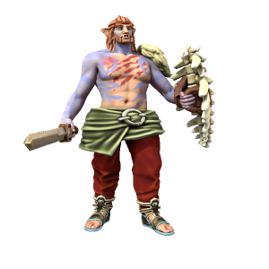
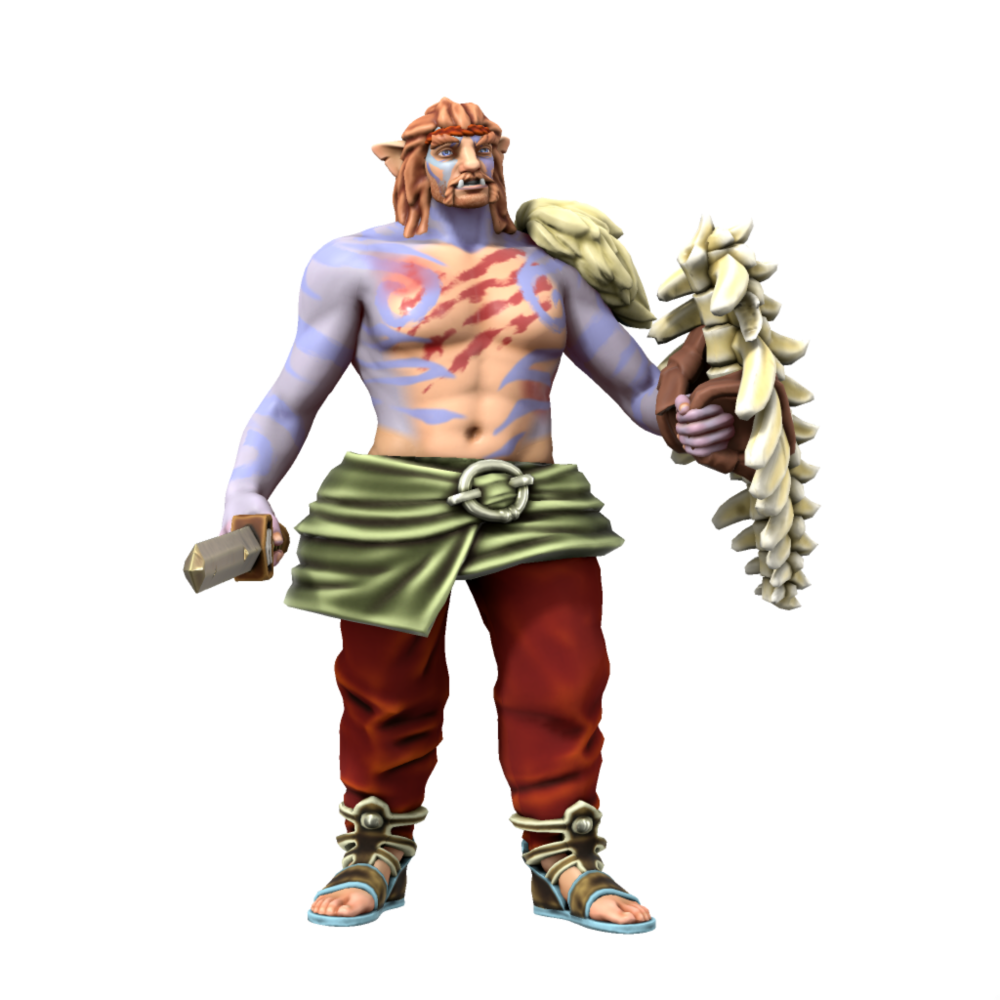

# Iotun
/ɪəʊtʌn/

Sometimes known simply as "The First People", these giants were the parent species of all homonids in Iuncterra. No Iotun

#### Tunnic

The earliest iotun lived in what is now Uttmark, these hunters thrived in the cold north, hunting the large animals which they lived alongside. Their most direct ancestors are [Veldspine Jotun](/lore/species/jotun#veldspine-jotun).

#### Salaen

The salt kings of the south, based out of what is now the eastern [DIR](/places/dracean_intercoastal_republic), pushed south by mining salt to trade with their tunnic kin in the north for food. As the best means of preserving and sanitizing food, salt was tremendously valuable to the iotun, so despite the lack of wild game in the south the Salean iotun rarely went hungry. These iotun were shorter than their northern kin - they were to become the first humans, the primary adversaries of early Draceans, and the ancestors of modern Servians.

#### Yamn

The earliest iotun pastoralists, the acestors of modern orc. Yamni descended from Saleans, specialising in horse husbandry as a source of food before the advent of agriculture. Yamn emerged somewhere in the evolutionary timeline from Salean iotun to Salean humans.

#### Proto-Savonii
Salean settlers who braved the hostile Yamn to travel south reached a land of dense forests, well suited to the hunter gatherer lifestyle of iotun. There they settled and become deeply invested in the lore of trees, eventually coupling with local [nymphs](/lore/cosmology/deigen/nymph) to create modern day elves.

### Ageing
|/lore/species/Aging.xlsx:Iotun|