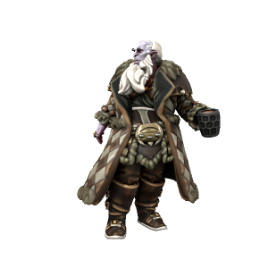

# Jotun
/jəʊtʌn/

## Physiology
Jotun are noticeably larger than other hominids, standing anywhere between 8 and 10 feet tall. They have tough skin

### Variation
Between different regions, jotun differ wildly in skin colour. Those in the cold North are generally shades of light purple or blue, while those who migrated south to Feldsheaf developed a vivid orange colouration.

Male and female jotun also differ in terms of hair growth. Similar to [dwarves](dwarf), female and male jotun can both grow facial hair, but female jotun don't develop any hair around their mouths and chins, sporting a "mutton chops" look when their hair grows out. Similar to [orc](orc), neither male nor female jotun can grow hair on their top lip.

### Aging
Jotun live to be around 100 on average, aging at a similar rate to humans, just 1/5 slower.
| Human age | Jotun equivalent  |
| --- | --- |
| 6         | 8                |
| 12        | 15               |
| 18        | 23               |
| 21        | 26               |
| 30        | 38               |
| 40        | 50               |
| 50        | 63               |
| 60        | 75               |
| 70        | 88               |
| 80        | 100              |

## Anthropogeny
Jotun are the closest extant relatives of [iotun](iotun). While the iotun who migrated south became smaller and lost the hardy disposition of their ancestors, an evolutionary tradeoff for a smaller apetite better suited to large-scale agriculture, those who remained in the cold North retained these traits and became the modern species of jotun.

## Geography
Most jotun live in the cold north of Iuncterra, scattered sparsely across small settlements. Many choose to live entirely solitary existances, meeting up only at religious festivals, or sometimes solely to have children. Most choose to live in small groups and pursue a nomadic hunter-gatherer lifestyle. More recently, in evolutionary terms at least, jotun have settled in the north east of [Ordo'Atkan](/places/Ordo_Atkan), living and hunting in the snowcapped peaks of the mountain range there.