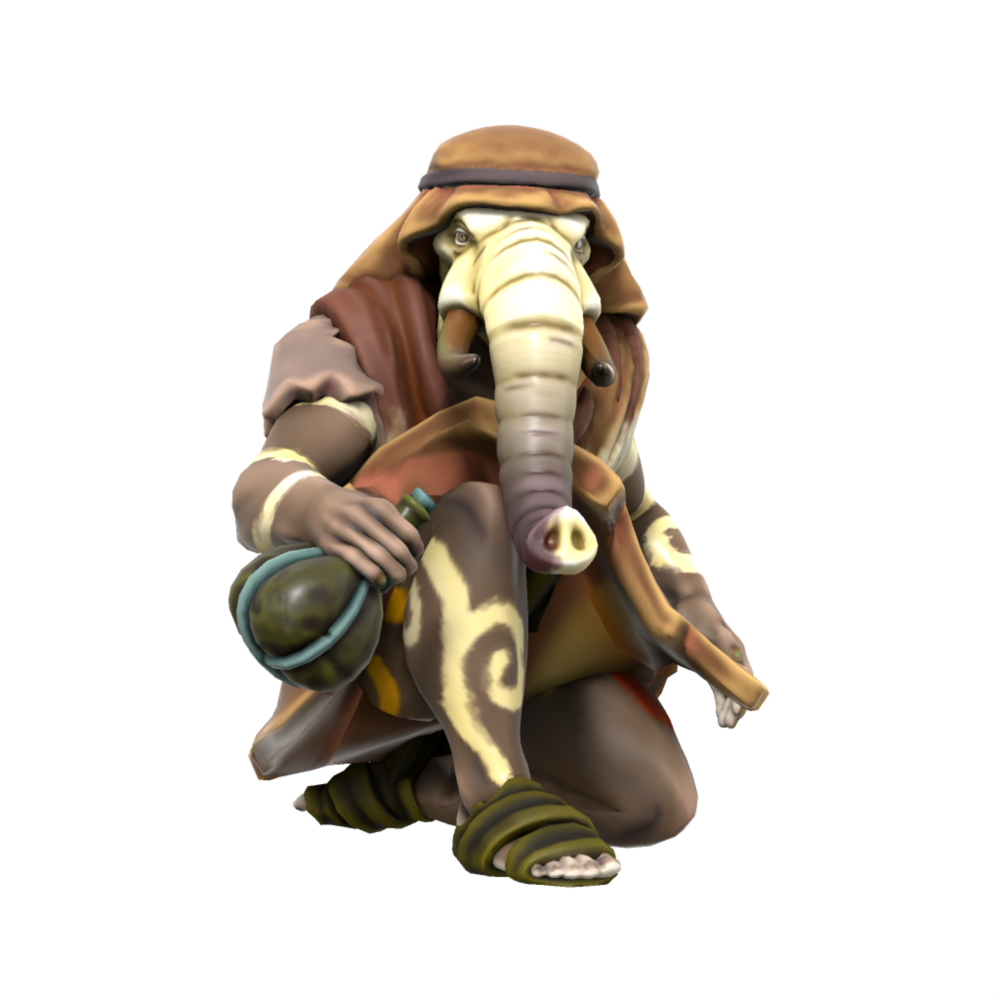

# Loxodon
/lɒksəʊdɒn/

Native to what is now the elven kingdom of Kashar, loxodon are the descendents of survivors from [Nasruk](/places/nasruk). In recognition of their martyrdom, the once human people were transformed in the likeness of [Ouron](/lore/cosmology/fey/ouron). Loxodon dwelt in what is now Kashar long before it was settled by elves, but have since integrated well into Kasharite society.

### Cultures

#### Nasruki Loxodon
/nɑzrʊki/

> **Languages** [Low Nasruki](/lore/languages/nasruki#low-nasruki)

Some particularly hardy loxodon choose to dwell around the outskirts of the desert of Nasruk, predominantly religious fanatics who believe in the inevitable restoration of Nasruk. Nasruki loxodon live a life of devotion to Ouron and reject the Kasharite religion, which they view as heresy. Nasruki loxodon exclusively speak low Nasruki, rejecting even common as a heretical language.

#### Kasharite Loxodon
/kʌʃɑraɪt/

> **Languages** [Low Kushite](/lore/languages/kushite#low-kushite), [Common](/lore/languages/common), [Nasruki Kushite](/lore/languages/nasruki#nasruki-kushite), [High Kushite](/lore/languages/kushite#high-kushite) (elites only)

The majority of loxodon live in Kashar, mostly in Jami-Marub, integrating with little friction into Kasharite society and living much as any other Kasharite might. Loxodon in Kashar generally speak either high or low kushite, though some loxodon-specific religious rites are performed in the otherwise extinct language nasruki kushite.

### Ageing
|/lore/species/Aging.xlsx:Loxodon|