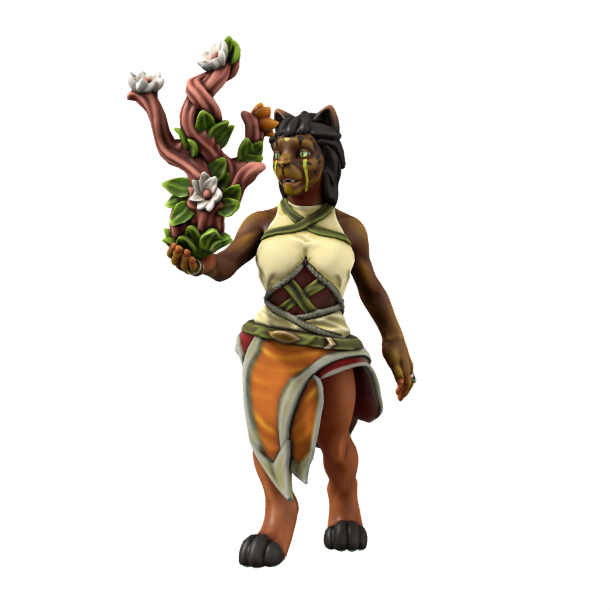
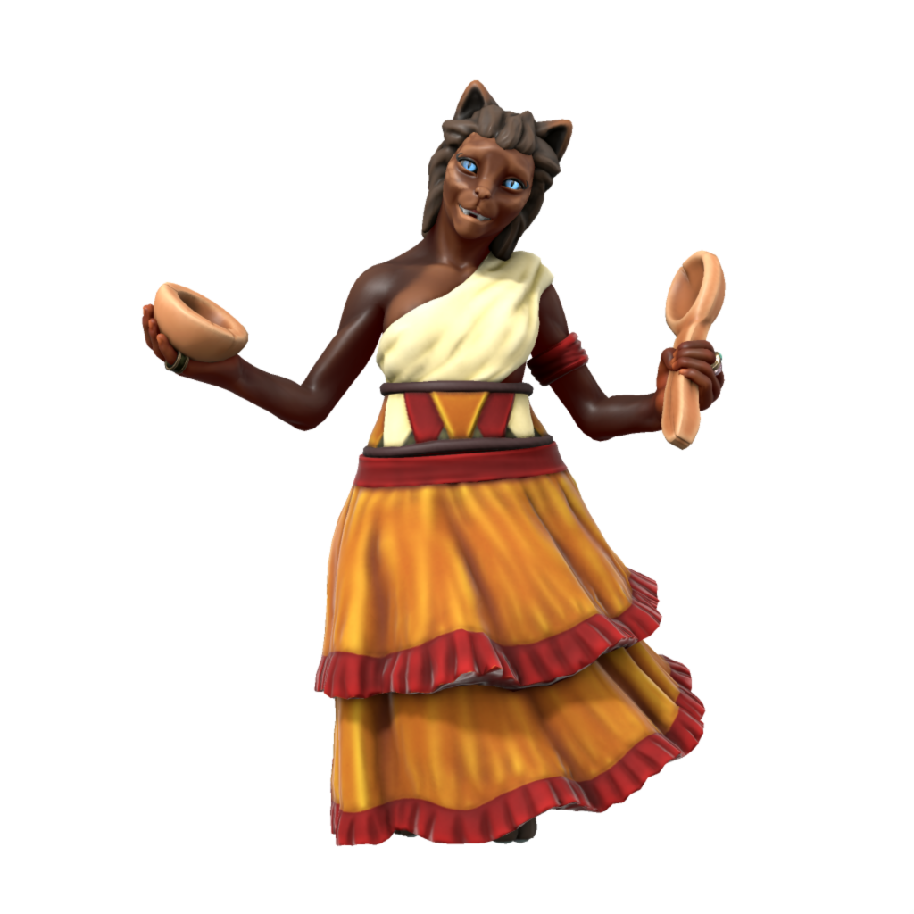
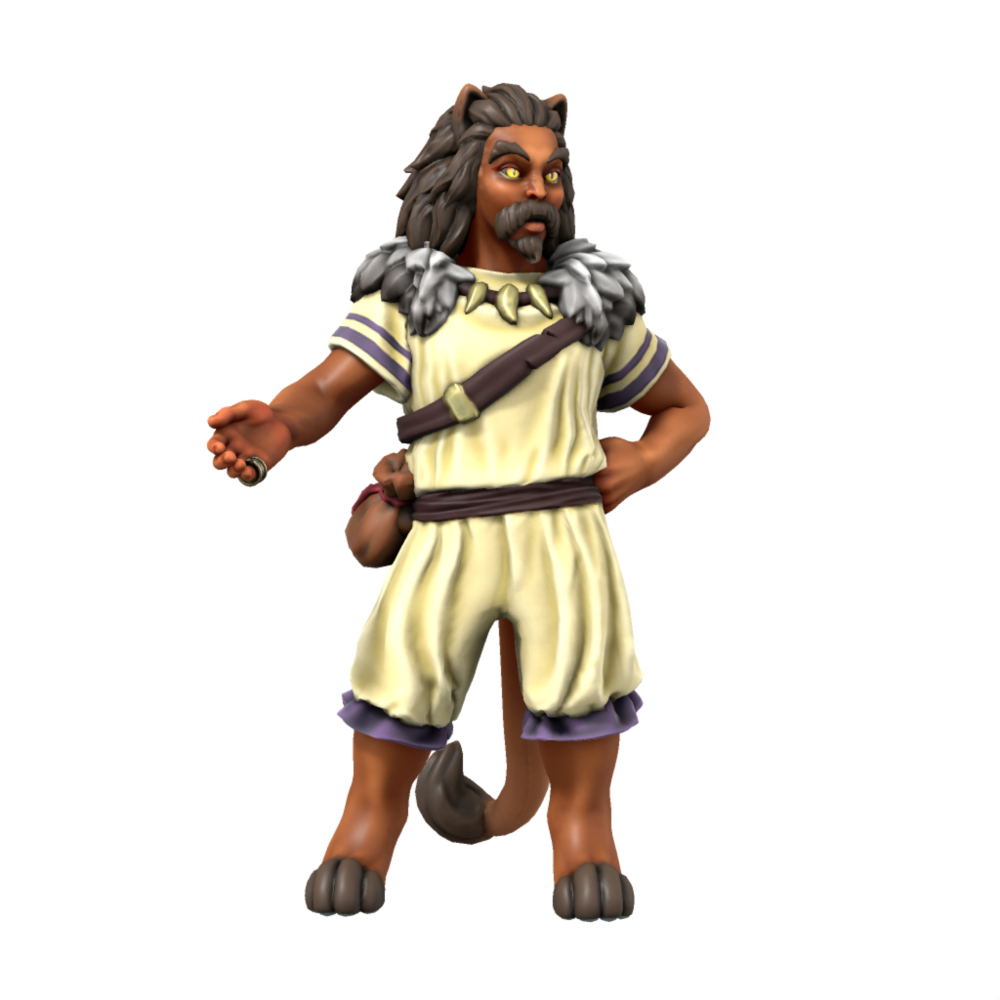
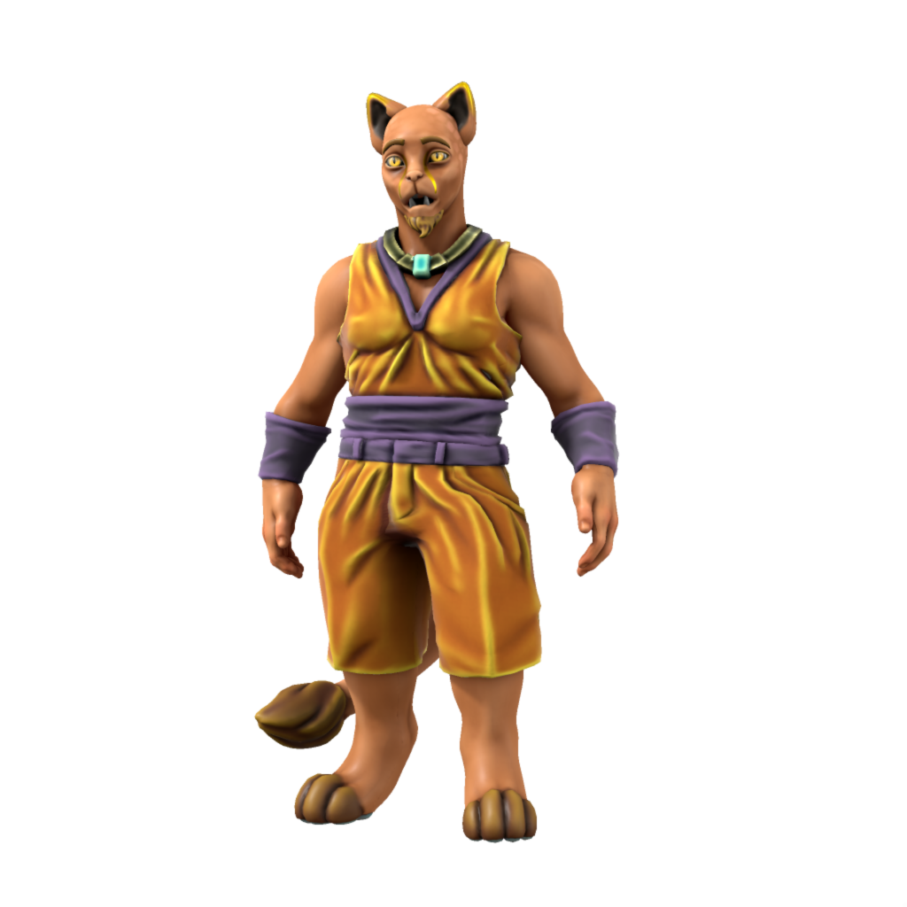

# Tabaxi
/tæbæksi/

Deep in the Parbat mountains, shrouded by an otherworldly mist, lies the valley of Nascut Deia, land of the chosen people [Deia](/lore/cosmology/fey/deia), carers of the sacred tree. Once, Tabaxi were like [elves](/lore/species/elf) in appearance, but as recognition of their service to Deia, She blessed them with her own visage.

Tabaxi can now be found all around the Parbat mountain range. Though all hold a unique fondness for the natural world, many live metropolitan lives.

### Cultures

#### Nascuti Tabaxi

> **Languages** [Tabax](/lore/languages/parbati#tabax), [Parbati](/lore/languages/parbati)

Tabaxi of Nascut Deia are reclusive, living lives of deep devotion to Deia, their way of life having gone unchanged for centuries. Nascuti rarely venture out from their mountain home, and while they hold no hostility to outsiders, only tabaxi may enter the sacred grove and look upon the sacred tree, so the full extent of their culture is a mystery to all but themselves.

#### Coastal Tabaxi

> **Languages** [Tabax](/lore/languages/parbati#tabax), [Common](/lore/languages/common)

Along the Parbati coast lie a spattering of Tabaxi settlements, largely overlooked by the great powers of the world due to their lack of resources and difficulty to farm at scale, these settlements are blessed with little but pleasant weather and breathtaking scenery. The tabaxi who live in these states are easy going, living life at a relaxed pace fitting their surroundings.

#### Parbatian-Dracean Tabaxi

> **Languages** [Tabax](/lore/languages/parbati#tabax), [Scutian](/lore/languages/parbati#scutian), [Common](/lore/languages/common)

Acting as something of a trade buffer between the rest of the [DIR](/places/dracean_intercoastal_republic) and the free tabaxi states, Parbatia consists of the tabaxi states which once bordered the republic, which only in the past century have built a sense of shared national identity and joined. Tabaxi who live here are generally trade focused, often being skilled negotiators.

#### Kasharite Tabaxi

> **Languages** [Tabax](/lore/languages/parbati#tabax), [Low Kushite](/lore/languages/kushite#low-kushite), [Common](/lore/languages/common)

Tabaxi in Kashar are an oppressed group, with Jami-Parbat often denied support given to the other provinces of Kashar. Being separated from coastal tabaxi by the Parbat mountain range, Kasharite tabaxi are more a culture unto themselves, blending elements of Kasharite culture with more traditional tabaxi practices. They also differ greatly in appearance from other tabaxi, with much shorter and thinner fur, having adapted to the hotter climate of Kashar.

### Ageing
|/lore/species/Aging.xlsx:Tabaxi|