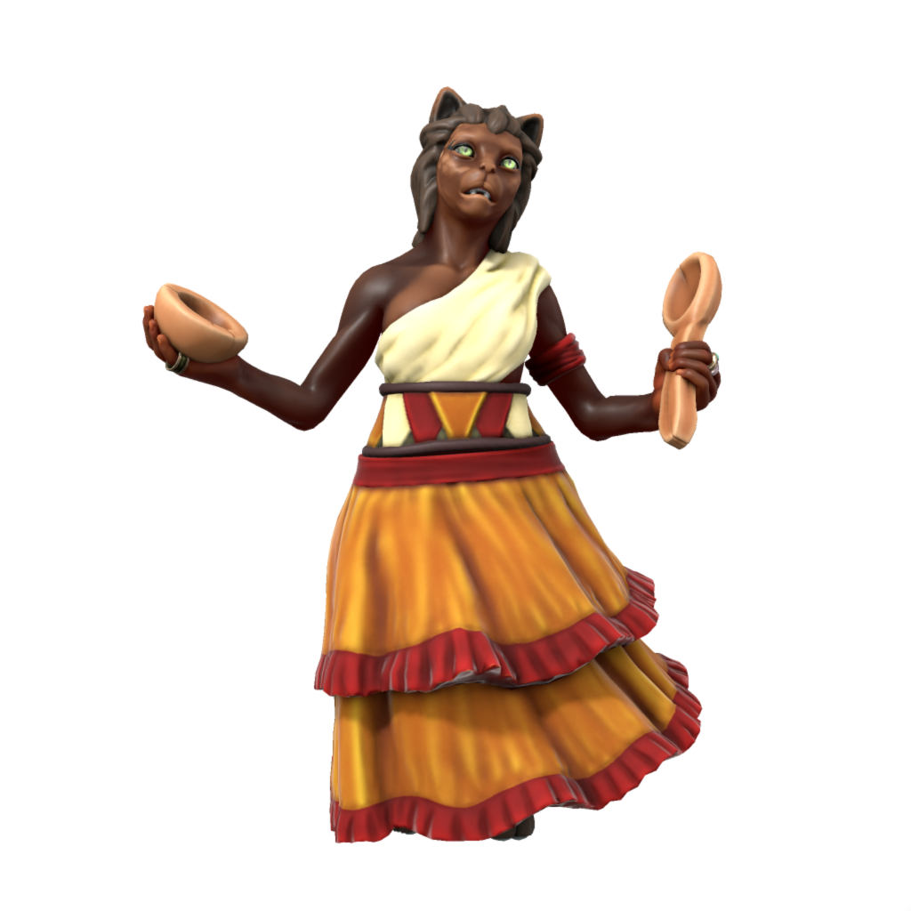

# Tabaxi
/tæbæksi/

Much as loxodon originated from the union of a fey with a proto-Orc, Tabaxi originate from a fey and a human. A much more recent species, tabaxi can be found in several regions of Iuncterra.

#### Free Tabaxi

#### Parbatian-Dracean Tabaxi

#### Kasharite Tabaxi

### Ageing
|/lore/species/Aging.xlsx:Tabaxi|