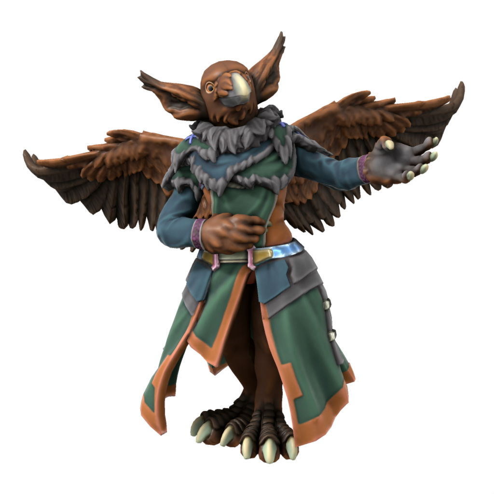

# Aarakocra
/ərəkɒkrɑ/

> **Languages** [Common](/lore/languages/common), [Ataithan](/lore/languages/ataithan), [Uttic](/lore/languages/uttic), often many more
> **Accent** 

The cosen people of [Hermet](/lore/cosmology/daemons/seraphim/hermet), Aarakocra were changed in their avian image after taking to the seas between Uttmark and Ataitha, demonstrating a love of exploration which the daemon found admirable. Aarakocrans rarely sail in modern times, prefering instead to use their powerful wings to fly wherever they need to go, but retain their love of exploration and mystery. Aarakocra spend most of their lives roaming, wanting to see as much as their short lives allow, so predominantly return home only to rear their young. As such, there is no aarakocran language - all speak Common, Ataithan and Uttic, but most speak many others, depending on the locations they frequent.

Being so close to Ataitha, Aarakocra are quite familiar with halflings (unlike the rest of Iuncterra), but not wanting to introduce the war and greed of the mainland to their peaceful and hedonic culture the first aarakocra vowed to [Ludonysos](/lore/cosmology/daemons/Seraphim/ludonysos) that neither they nor any of their kind would reveal the existance of the halflings to the rest of the world.

|Aging.xlsx:Aarakocra|