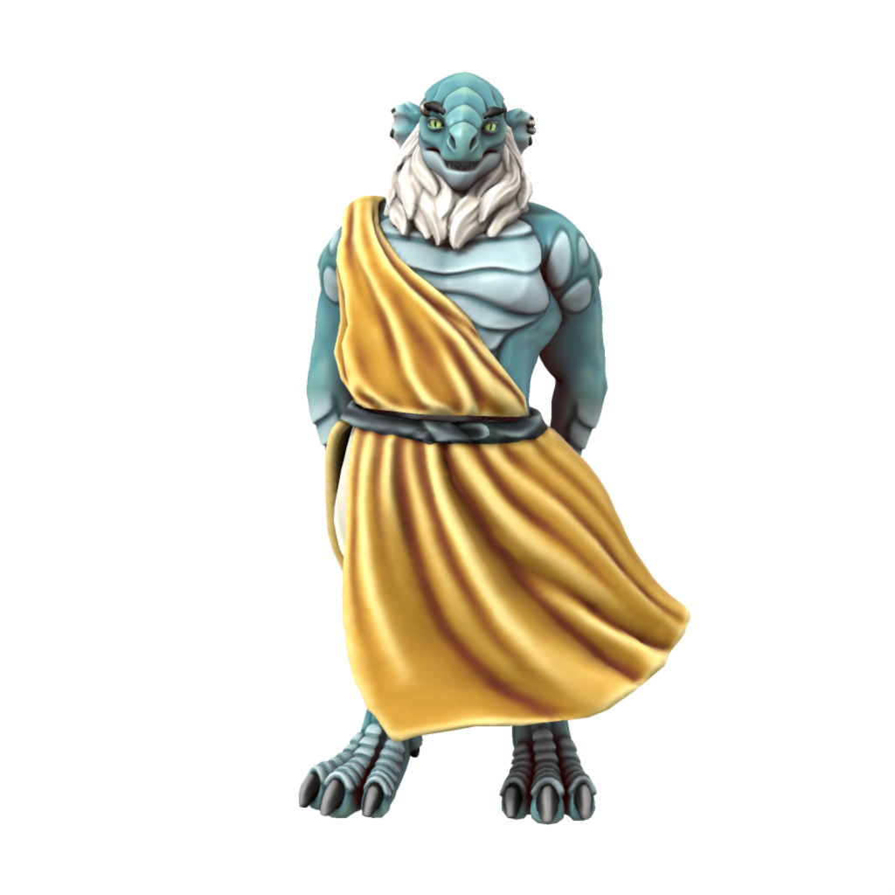
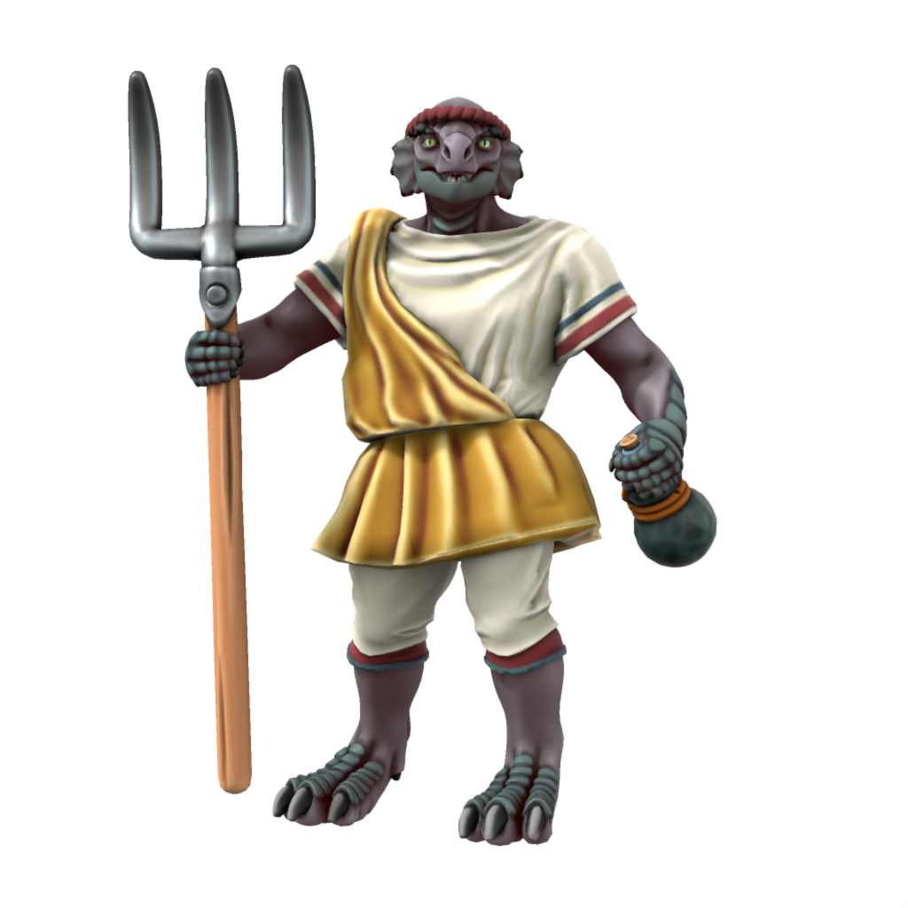

# Dragonborn

The proud sons and daughters of [Drace](/places/drace) descend directly from the great dragon [Draconus](/lore/cosmology/deigen/dragons/draconus) and thus embody many draconic features. They are a proud people with a strong sense of kinship, owing to their storied history.

### Cultures

#### Draceans
/dræʧeɪʌn/

> **Languages** [Common](/lore/languages/common), [Low Dracean](/lore/languages/dracean#low-dracean), [High Dracean](/lore/languages/dracean#high-dracean) (elites only)
> **Accent** [🗣️](https://www.dialectsarchive.com/italy-7)

Drace remains the largest single polity of dragonborn - even those who live outside of the eternal city will frequently travel back to reconnect with their Dracean heritage. Those who live in the city itself are a deeply proud people, most working in either learned professions or living purely aristocratic lives. This presents a problem with feeding a large metropolitan population, the city is deeply in debt and would not survive without trade with its neighbours.

#### Provincial Dragonborn

> **Languages** [Common](/lore/languages/common), [Low Dracean](/lore/languages/dracean#low-dracean), [[[Servian](/lore/languages/servian), [Noordic](/lore/languages/noordic) or [Scutian](/lore/languages/parbati#scutian)]]
> **Accent** [🗣️](https://www.dialectsarchive.com/netherlands-1)

In the days of the Dracean Empire, dragonborn could be found across the continent. The descendents of these dragonborn can still be found across what is now the [Dracean Intercoastal Republic](/places/dracean_intercoastal_republic/), living much as any other citizens of the republic. Though, most dragonborn retain a certain reverence for the city of Drace and Dracean culture in general.

### Ageing
|/lore/species/Aging.xlsx:Dragonborn|
