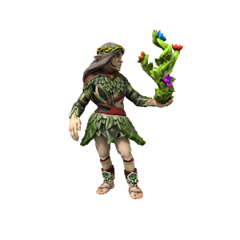

# Elf

Elves originate from the woods of [T'Savo](/places/tsavo), where proto-human Iotun interbred with forest nymphs. They are delicately featured with pointed ears, most are very lithe and nimble. While long lived, they are not immortal as nymphs are.
{: .full-width}

### Cultures

#### Savonic Elves
/sɑvɒnɪk/

> **Languages** [Low Savonic](/lore/languages/savonic#low-savonic), [Common](/lore/languages/common), [High Savonic](/lore/languages/savonic#high-savonic) (elites only)
> **Accent** [🗣️](https://www.dialectsarchive.com/morocco-1)

Elves from the imperial capital tend to be somewhat disdainful of "lesser" cultures, taking great pride in the longevity and power of their empire.

#### Kasharite Elves

> **Languages** [Low Kushite](/lore/languages/kushite#low-kushite), [Common](/lore/languages/common), [High Kushite](/lore/languages/kushite#high-kushite) (elites only)
> **Accent** [🗣️](https://www.dialectsarchive.com/saudi-arabia-1)

Elves of the Kasharite Sultanate are long removed from their Savonic kin, separated by the hostile [Atkani steppe](/places/Ordo_Atkan/). They speak a variety of different languages, worship the eternal flame of the Kash dynasty and culturally are strongly influenced by the [Loxodon](/lore/species/loxodon) natives of the land they occupy.

#### Wood Elves

> **Languages** [High Savonic](/lore/languages/savonic#high-savonic)
> **Accent** [🗣️](https://www.dialectsarchive.com/iran-1)

Elves from the heavily forested south of [T'Savo](/places/tsavo) are a mysterious people, even to their Savonic kin little is known of their ways. They are hostile to most outsiders, but especially to imperials - viewing them as traitors to their nymphic heritage.

### Ageing
|/lore/species/aging.xlsx:Elf|