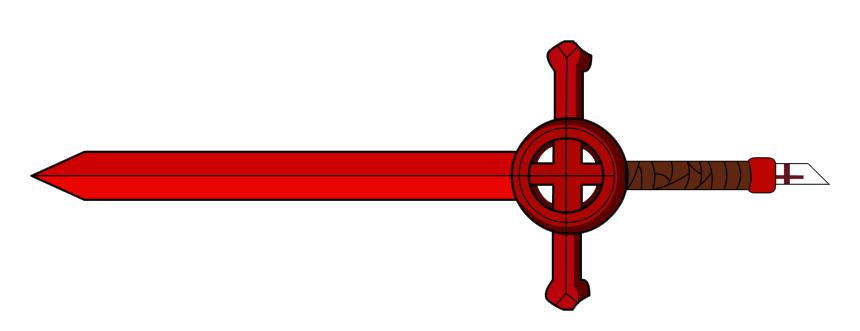

# Bloodswords

The Bloodswords are a mercenary guild, operating world-wide. Its operatives are referred to as bloodswords, in lower case.

## Divisions

### Ground Military

The Bloodswords' bread and butter is its ground forces. It is among the largest mercenary guilds in the world, and many wars have been won or lost based on which side was able to hire more bloodswords.

### Naval Fleet

The Bloodswords' fastest growing division is its naval forces. Bloodswords warships function as privateers, taking payment from global powers seeking to weaken their rivals without risking all-out war in exchange for raiding particular vessels. 

### Magic Arsenal

In recent years, the Bloodswords have been looking to diversity their fighting forces by utilising wizards and sorcorers. This division remains small, but has yielded some promising results.