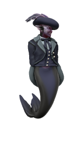

# Ventis
*they/them, djinn/elf, lawful evil*

Tieflings are most often the offspring of infernals with humanoids, sometimes (particularly at sea) the offspring of aquans and humanoids, but a half-djinn tiefling is a rare being indeed. Ventis may not have the earth-shattering cosmic power of their magical parent, but they're a capable sorcerer with a cunning and devious mind.

## Background

Ventis insists they are the legitimate heir to Kashar, their title having been usurped by a younger step-brother in retribution for the affair Ventis’ Mother had with a Djinn. Ventis has lived for hundreds of years, so this sibling is long since dead, but they retain their claim to the empire and hope to someday become powerful enough to take their throne by force.

After hearing that [Baal Adhikari](https://cobalt-sea.fandom.com/wiki/baal_Adhikari "Baal Adhikari"), renowned privateer and loyal retainer of the [Kashar](https://cobalt-sea.fandom.com/wiki/kashar "Kashar")ite Sultan, had been killed by [Bertha Bloodletter](https://cobalt-sea.fandom.com/wiki/bertha_Bloodletter "Bertha Bloodletter"), Ventis' interest was piqued and they offered their service to the new Captain. The enemy of one's enemy is one's friend, in so far as Ventis is capable of friendship.